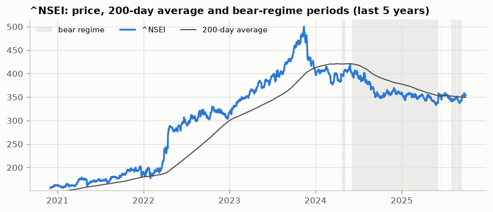
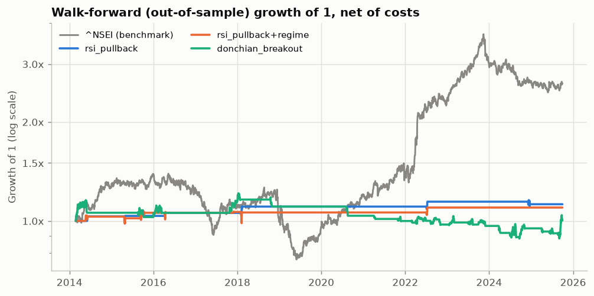
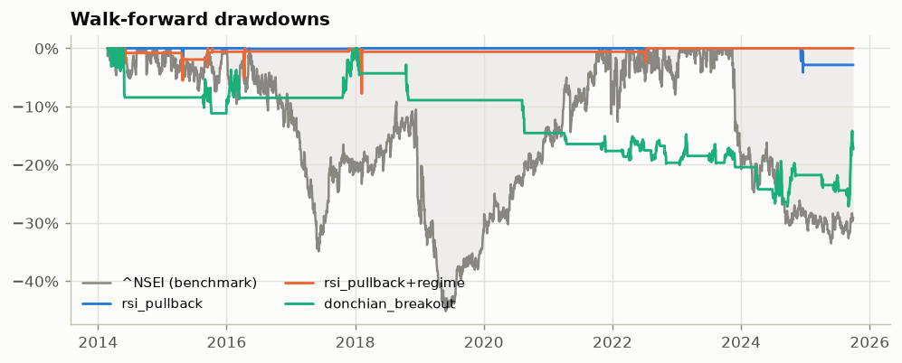
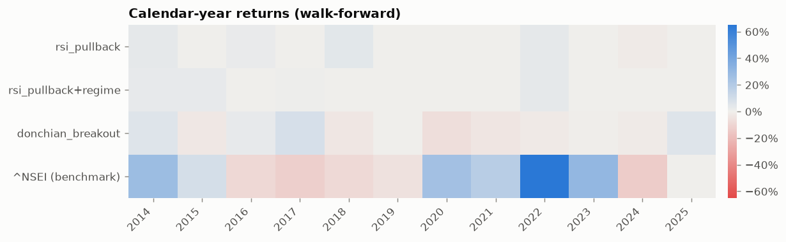
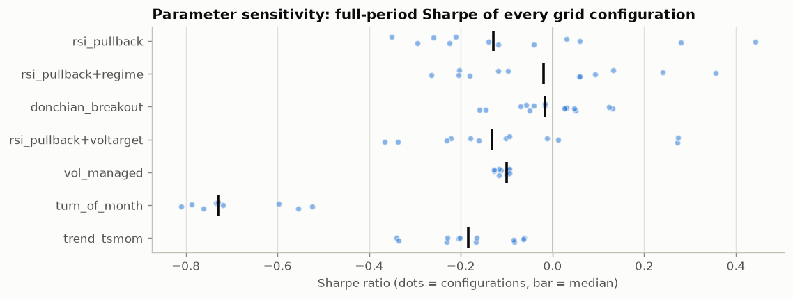
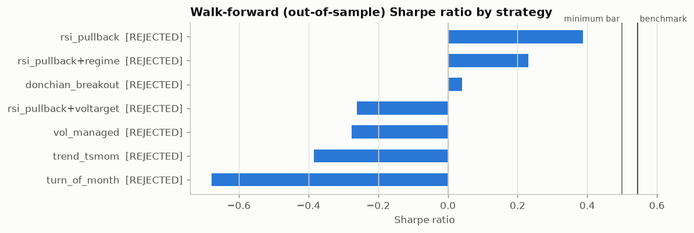
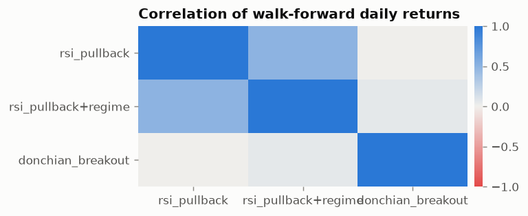

# Trading Strategy Research Report: `india-reliance`

> ⚠️ **SYNTHETIC DATA: results demonstrate the pipeline only and are NOT evidence about any real market.**
>
> ℹ️ Single-stock study: cross-sectional and pairs strategies do not apply; concentration risk is inherent.

| Item | Value |
|---|---|
| Universe | RELIANCE.NS (1 asset) |
| Benchmark | ^NSEI |
| Data | synthetic, 2008-01-01 → 2025-09-30 (4,631 sessions) |
| Costs | india_equity: buy 17.0 bps / sell 15.5 bps per side (commission 0.5, slippage 5, taxes 11.5/10), sqrt-impact Y=0.5, borrow 300 bps/yr, leverage financing +150 bps/yr |
| Execution | `next_open` · capital 1,000,000 · risk-free 0.0% |
| Validation | IS/OOS split at 2020-10-07; walk-forward 5.0y train / 1.0y test (rolling), 12 windows |
| Trials | 85 parameter configurations across 7 strategy variants |
| Generated | 2026-09-30 in 13s by `tradelab` |

## 1. Executive Summary

**7 strategy variants** (5 base strategies + 2 iteration variants) were researched on 1 asset, testing **85 parameter configurations** in total. Result: **0 validated**, **0 promising**, **7 rejected**.

Benchmark (^NSEI) over the same walk-forward period: CAGR 8.4%, Sharpe 0.54, max drawdown 45.2%.

**No strategy cleared the quality bar.** Out of sample and after realistic costs, none of the candidates beat the benchmark on a risk-adjusted basis with acceptable drawdown and robustness. **Recommendation: do not deploy any of these strategies on this universe.** Holding the benchmark is the better-evidenced choice. See §6 for next steps.

**Key findings**

- Best out-of-sample Sharpe: **rsi_pullback** at 0.39 (benchmark 0.54).
- Median walk-forward Sharpe was **34% of the in-sample Sharpe**, which shows how much a naive in-sample backtest overstates the edge.
- Cost-fragile (Sharpe falls by more than half at 2x costs): donchian_breakout.
- After a multiple-testing haircut for 85 trials, 0 variant(s) have deflated Sharpe ≥ 0.9.
- All strategies passed the look-ahead truncation test.
- Current market regime (2025-09-30): **sideways** trend, **normal vol** (21-day vol 14.9%).

## 2. Market Analysis

### 2.1 Current regime: facts

| Metric | Value |
|---|---|
| As of | 2025-09-30 |
| Trend regime | sideways |
| Volatility regime | normal vol |
| Return 1m / 3m / 6m / 12m | 3.8% / -0.5% / 2.5% / 0.8% |
| Distance from 200-day SMA | 1.5% |
| 50-day SMA above 200-day | no |
| Drawdown from high | -29.1% |
| Realised vol 21d (3y median) | 14.9% (13.2%) |
| Vol percentile (3y) | 66% |



### 2.2 Interpretation (heuristic, not evidence)

- Trend is ambiguous (price and the 200-day average disagree). Range-bound conditions tend to cause whipsaws for trend rules and favour mean reversion.
- The benchmark is 29% below its high, which is correction or bear-market territory.

### 2.3 Opportunity scan

| asset | ret_1m | ret_3m | ret_6m | ret_12m | rel_strength_6m | vol_3m | dist_52w_high | rsi14 | above_200d | z_1m_move | volume_trend | flags |
|---|---|---|---|---|---|---|---|---|---|---|---|---|
| RELIANCE.NS | 16.4% | 17.3% | 5.8% | -7.8% | 3.3% | 36.0% | -14.3% | 62 | True | 1.69 | 0.95 |  |

### 2.4 Macro context

_Macro series not available for this data source. Rates, the dollar, oil and VIX are fetched automatically only with `--source yahoo`. Fundamentals, options flow and news are **not** used by this framework, so treat them as unassessed._

### 2.5 Data quality

| ticker | status | first | last | observations | missing_sessions | max_abs_daily_move | flags |
|---|---|---|---|---|---|---|---|
| RELIANCE.NS | ok | 2008-01-01 | 2025-09-30 | 4631 | 0 | 19.4% |  |
| ^NSEI | ok | 2008-01-01 | 2025-09-30 | 4631 | 0 | 14.0% |  |

## 3. Strategy Details

Strategies not applicable to this universe: `xs_momentum` (needs >= 4 assets (universe has 1)); `xs_reversal` (needs >= 5 assets (universe has 1)); `pairs_stat_arb` (needs >= 2 assets (universe has 1)); `low_vol` (needs >= 3 assets (universe has 1)).

### 3.1 rsi_pullback: ❌ REJECTED

*Short-term mean reversion (buy the dip in an uptrend)*

- **Thesis / why the edge might exist:** Short-horizon selling pressure (stop-outs, forced liquidations, over-reaction to noise) pushes prices below fair value for a few days; within an established uptrend these dips tend to be bought. The trend filter avoids catching falling knives in bear markets.
- **Rules:** Enter long when RSI(`rsi_len`) < `entry` and close > `trend_len`-day SMA; exit when RSI > `exit` or after `max_hold` sessions.
- **Position sizing:** 1/N of capital per asset slot; no leverage.
- **Rebalance:** Event driven (signal checked every close).
- **Universe:** RELIANCE.NS (long-only)
- **Parameter grid:** `rsi_len` ∈ [2, 3]; `entry` ∈ [5, 10, 20]; `exit` ∈ [50, 70] (12 configurations)
- **In-sample choice:** `rsi_len=3`, `entry=5`, `exit=50`, `trend_len=200`, `max_hold=10`
- **Deployed (latest walk-forward window):** `rsi_len=3`, `entry=5`, `exit=70`, `trend_len=200`, `max_hold=10`
- **Invalidation:** If the edge disappears with a one-day execution delay or at 2x costs, it is too thin to trade; a regime of persistent momentum crashes (dips keep falling) invalidates the premise.
- **References:** Connors & Alvarez (2009), 'Short Term Trading Strategies That Work'; Jegadeesh (1990), 'Evidence of Predictable Behavior of Security Returns', JF
- **Code:** [`mean_reversion.py` → `RSIPullback`](../../tradelab/strategies/mean_reversion.py)

### 3.2 rsi_pullback+regime: ❌ REJECTED

*Short-term mean reversion (buy the dip in an uptrend) + regime overlay*. Iteration of rsi_pullback (failed: Positive calendar years, Sharpe minus benchmark Sharpe, Walk-forward Sharpe).

- **Thesis / why the edge might exist:** Short-horizon selling pressure (stop-outs, forced liquidations, over-reaction to noise) pushes prices below fair value for a few days; within an established uptrend these dips tend to be bought. The trend filter avoids catching falling knives in bear markets. OVERLAY: Market regime filter: only hold positions while the benchmark trades above its `regime_sma`-day moving average (2% hysteresis band). Addresses drawdowns concentrated in bear markets.
- **Rules:** Enter long when RSI(`rsi_len`) < `entry` and close > `trend_len`-day SMA; exit when RSI > `exit` or after `max_hold` sessions. Market regime filter: only hold positions while the benchmark trades above its `regime_sma`-day moving average (2% hysteresis band). Addresses drawdowns concentrated in bear markets.
- **Position sizing:** 1/N of capital per asset slot; no leverage.
- **Rebalance:** Event driven (signal checked every close).
- **Universe:** RELIANCE.NS (long-only)
- **Parameter grid:** `rsi_len` ∈ [2, 3]; `entry` ∈ [5, 10, 20]; `regime_sma` ∈ [150, 200] (12 configurations)
- **In-sample choice:** `rsi_len=3`, `entry=5`, `exit=70`, `trend_len=200`, `max_hold=10`, `regime_sma=200`
- **Deployed (latest walk-forward window):** `rsi_len=3`, `entry=5`, `exit=70`, `trend_len=200`, `max_hold=10`, `regime_sma=150`
- **Invalidation:** If the edge disappears with a one-day execution delay or at 2x costs, it is too thin to trade; a regime of persistent momentum crashes (dips keep falling) invalidates the premise.
- **References:** Connors & Alvarez (2009), 'Short Term Trading Strategies That Work'; Jegadeesh (1990), 'Evidence of Predictable Behavior of Security Returns', JF
- **Code:** [`mean_reversion.py` → `RSIPullback`](../../tradelab/strategies/mean_reversion.py) + overlay in [`overlays.py`](../../tradelab/strategies/overlays.py)

### 3.3 donchian_breakout: ❌ REJECTED

*Breakout (price-channel trend)*

- **Thesis / why the edge might exist:** A close beyond the recent trading range signals new information or a shift in supply/demand that the market has not yet fully priced; asymmetric exits (a shorter exit channel) cut losers quickly and let winners run, producing positively skewed payoffs. This is the classic Turtle rule set.
- **Rules:** Enter long when the close exceeds the highest high of the prior `entry` sessions; exit when the close falls below the lowest low of the prior `exit` sessions.
- **Position sizing:** Position size fixed at entry: `vol_target`/N divided by the asset's 63-day volatility, capped at 100% per asset and 100% gross.
- **Rebalance:** Event driven: trades only on breakout entries and channel exits.
- **Universe:** RELIANCE.NS (long-only)
- **Parameter grid:** `entry` ∈ [20, 55, 100]; `exit` ∈ [10, 20, 50]; `vol_target` ∈ [0.1, 0.2] (15 configurations)
- **In-sample choice:** `entry=100`, `exit=10`, `vol_target=0.2`, `vol_window=63`, `max_gross=1.0`
- **Deployed (latest walk-forward window):** `entry=20`, `exit=10`, `vol_target=0.2`, `vol_window=63`, `max_gross=1.0`
- **Invalidation:** Breakouts that systematically fail (false breakouts > ~65% with no fat right tail) or a win/loss size ratio that collapses below ~1.5 out of sample.
- **References:** Donchian (1960); Faith (2007), 'Way of the Turtle'; Brock, Lakonishok & LeBaron (1992), 'Simple Technical Trading Rules', JF
- **Code:** [`trend.py` → `DonchianBreakout`](../../tradelab/strategies/trend.py)

### 3.4 rsi_pullback+voltarget: ❌ REJECTED

*Short-term mean reversion (buy the dip in an uptrend) + voltarget overlay*. Iteration of rsi_pullback (failed: Positive calendar years, Sharpe minus benchmark Sharpe, Walk-forward Sharpe).

- **Thesis / why the edge might exist:** Short-horizon selling pressure (stop-outs, forced liquidations, over-reaction to noise) pushes prices below fair value for a few days; within an established uptrend these dips tend to be bought. The trend filter avoids catching falling knives in bear markets. OVERLAY: Portfolio volatility targeting: scale the whole book to `port_vol` annualised volatility using the trailing 63-day volatility of the base book (max 1.0x, 10% steps). Addresses deep drawdowns and volatility clustering.
- **Rules:** Enter long when RSI(`rsi_len`) < `entry` and close > `trend_len`-day SMA; exit when RSI > `exit` or after `max_hold` sessions. Portfolio volatility targeting: scale the whole book to `port_vol` annualised volatility using the trailing 63-day volatility of the base book (max 1.0x, 10% steps). Addresses deep drawdowns and volatility clustering.
- **Position sizing:** 1/N of capital per asset slot; no leverage.
- **Rebalance:** Event driven (signal checked every close).
- **Universe:** RELIANCE.NS (long-only)
- **Parameter grid:** `rsi_len` ∈ [2, 3]; `entry` ∈ [5, 10, 20]; `port_vol` ∈ [0.08, 0.12] (12 configurations)
- **In-sample choice:** `rsi_len=3`, `entry=5`, `exit=70`, `trend_len=200`, `max_hold=10`, `port_vol=0.12`
- **Deployed (latest walk-forward window):** `rsi_len=3`, `entry=5`, `exit=70`, `trend_len=200`, `max_hold=10`, `port_vol=0.08`
- **Invalidation:** If the edge disappears with a one-day execution delay or at 2x costs, it is too thin to trade; a regime of persistent momentum crashes (dips keep falling) invalidates the premise.
- **References:** Connors & Alvarez (2009), 'Short Term Trading Strategies That Work'; Jegadeesh (1990), 'Evidence of Predictable Behavior of Security Returns', JF
- **Code:** [`mean_reversion.py` → `RSIPullback`](../../tradelab/strategies/mean_reversion.py) + overlay in [`overlays.py`](../../tradelab/strategies/overlays.py)

### 3.5 vol_managed: ❌ REJECTED

*Volatility timing (risk management as a return source)*

- **Thesis / why the edge might exist:** Volatility clusters and is forecastable, while expected returns do not rise proportionally when volatility spikes. Scaling exposure inversely to recent variance therefore improves risk-adjusted returns and shrinks crash exposure. The edge comes from risk timing, not from direction.
- **Rules:** Always long; exposure = min(max_leverage, vol_target / realised vol) per asset, in 10% steps.
- **Position sizing:** Equal risk budget per asset (1/N of the scaled exposure); leverage only if max_leverage > 1.
- **Rebalance:** Weekly (every 5 sessions); exposure quantised to 10% steps to limit churn.
- **Universe:** RELIANCE.NS (long-only)
- **Parameter grid:** `vol_window` ∈ [21, 63]; `vol_target` ∈ [0.1, 0.15, 0.2]; `max_leverage` ∈ [1.0, 1.5] (13 configurations)
- **In-sample choice:** `vol_target=0.1`, `vol_window=63`, `max_leverage=1.0`, `rebalance=5`
- **Deployed (latest walk-forward window):** `vol_target=0.12`, `vol_window=21`, `max_leverage=1.0`, `rebalance=5`
- **Invalidation:** Out-of-sample Sharpe no better than buy-and-hold, or losses concentrated in fast 'vol-of-vol' spikes where exposure is cut only after the damage (e.g. single-day crashes).
- **References:** Moreira & Muir (2017), 'Volatility-Managed Portfolios', JF; Harvey et al. (2018), 'The Impact of Volatility Targeting', JPM
- **Code:** [`trend.py` → `VolatilityManaged`](../../tradelab/strategies/trend.py)

### 3.6 turn_of_month: ❌ REJECTED

*Calendar / flow-driven event effect*

- **Thesis / why the edge might exist:** Equity returns cluster around the turn of the month: salaries, pension contributions and fund inflows are invested on predictable dates, and institutions window-dress before month end. The strategy is invested only a fraction of the time, so it earns a large share of the market's return with far less exposure.
- **Rules:** Long during the last `days_before` and first `days_after` business days of each month; cash otherwise.
- **Position sizing:** Equal weight across available assets; fully invested inside the window, flat outside.
- **Rebalance:** Calendar driven: two trades per month.
- **Universe:** RELIANCE.NS (long-only)
- **Parameter grid:** `days_before` ∈ [1, 2, 3]; `days_after` ∈ [1, 3, 5] (9 configurations)
- **In-sample choice:** `days_before=3`, `days_after=1`
- **Deployed (latest walk-forward window):** `days_before=2`, `days_after=1`
- **Invalidation:** Well-known calendar anomalies can be arbitraged away after publication; if the in-window average daily return is no longer higher than out-of-window returns in the walk-forward period, drop it.
- **References:** Ariel (1987), 'A Monthly Effect in Stock Returns', JFE; Lakonishok & Smidt (1988), 'Are Seasonal Anomalies Real?', RFS; McConnell & Xu (2008), 'Equity Returns at the Turn of the Month', FAJ
- **Code:** [`calendar.py` → `TurnOfMonth`](../../tradelab/strategies/calendar.py)

### 3.7 trend_tsmom: ❌ REJECTED

*Trend following (time-series momentum)*

- **Thesis / why the edge might exist:** Prices trend because information diffuses slowly, investors under-react and then herd, and risk-transfer flows (hedging, deleveraging, rebalancing) persist for weeks to months. Time-series momentum is documented across asset classes over a century of data and tends to profit in prolonged bear markets, which makes it a diversifier rather than a pure return engine.
- **Rules:** Long an asset when its trailing `lookback`-day total return is positive; flat otherwise (short instead if `allow_short`).
- **Position sizing:** Inverse volatility: each asset targets `vol_target`/N annualised vol from a 63-day estimate; gross exposure capped at 100% (no leverage).
- **Rebalance:** Every `rebalance` trading days.
- **Universe:** RELIANCE.NS (long-only)
- **Parameter grid:** `lookback` ∈ [63, 126, 252]; `vol_target` ∈ [0.1, 0.15]; `rebalance` ∈ [5, 21] (12 configurations)
- **In-sample choice:** `lookback=63`, `vol_target=0.15`, `rebalance=21`, `vol_window=63`, `allow_short=False`, `max_gross=1.0`
- **Deployed (latest walk-forward window):** `lookback=126`, `vol_target=0.15`, `rebalance=21`, `vol_window=63`, `allow_short=False`, `max_gross=1.0`
- **Invalidation:** Persistent whipsaw losses in range-bound markets with sharp V-shaped reversals; several years of negative out-of-sample returns during markets that did trend would falsify the premise.
- **References:** Moskowitz, Ooi & Pedersen (2012), 'Time Series Momentum', JFE; Hurst, Ooi & Pedersen (2017), 'A Century of Evidence on Trend-Following Investing'
- **Code:** [`trend.py` → `TimeSeriesMomentum`](../../tradelab/strategies/trend.py)

## 4. Backtest Results

### 4.1 How to read these numbers

- **Walk-forward (primary evidence):** parameters are re-chosen every 1.0y using only the previous 5.0y, then traded on unseen data. The stitched test periods (2014-02-24 → 2025-09-30) are the out-of-sample record. Switching costs between parameter sets are charged.
- Parameter choice favours stable *plateaus* in parameter space over isolated peaks.
- Signals use the close of day *t*; trades execute `next_open`. Costs, impact, borrow and financing are included. Idle cash earns the configured risk-free rate.
- Win rate and profit factor are measured per position spell (entry to exit, per asset).

### 4.2 Walk-forward performance (top strategies)

| Metric | rsi_pullback | rsi_pullback+regime | donchian_breakout | ^NSEI (benchmark) | Equal-weight buy & hold |
|---|---|---|---|---|---|
| Total return | 12.4% | 9.8% | 0.3% | 162.1% | -66.8% |
| CAGR | 1.0% | 0.8% | 0.0% | 8.4% | -8.8% |
| Volatility | 2.6% | 3.7% | 7.3% | 17.6% | 36.4% |
| Sharpe | 0.39 | 0.23 | 0.04 | 0.54 | -0.07 |
| Sortino | 0.65 | 0.37 | 0.06 | 0.81 | -0.10 |
| Max drawdown | 4.1% | 7.8% | 27.2% | 45.2% | 86.8% |
| Calmar | 0.24 | 0.10 | 0.00 | 0.18 | -0.10 |
| Win rate (trades) | n/a | n/a | 34.8% | n/a | n/a |
| Profit factor | n/a | n/a | 1.02 | n/a | n/a |
| Trades | 6 | 9 | 23 | 0 | 1 |
| Avg holding (bars) | 4.7 | 4.4 | 27.3 | n/a | 4630.0 |
| Turnover / yr | 1.0x | 1.5x | 1.6x | n/a | 0.0x |
| Cost drag / yr | 0.2% | 0.3% | 0.3% | n/a | 0.0% |
| Time in market | 0.9% | 1.3% | 20.8% | n/a | 100.0% |
| Beta | 0.01 | 0.01 | 0.09 | n/a | 1.21 |
| Positive years | 41.7% | 41.7% | 33.3% | 50.0% | 41.7% |
| Worst year | -1.8% | -0.4% | -6.2% | -13.4% | -40.6% |
| CVaR 95% (daily) | 0.0% | 0.0% | 1.2% | 2.5% | 5.4% |





### 4.3 All strategies: in-sample vs out-of-sample (overfitting check)

| strategy | IS Sharpe | OOS Sharpe (IS params) | Walk-forward Sharpe | WF CAGR | WF max DD | WF Sortino | Win rate | Profit factor | Turnover/yr |
|---|---|---|---|---|---|---|---|---|---|
| rsi_pullback | 0.66 | 0.08 | 0.39 | 1.0% | 4.1% | 0.65 | n/a | n/a | 1.0x |
| rsi_pullback+regime | 0.35 | 0.41 | 0.23 | 0.8% | 7.8% | 0.37 | n/a | n/a | 1.5x |
| donchian_breakout | 0.48 | -0.77 | 0.04 | 0.0% | 27.2% | 0.06 | 34.8% | 1.02 | 1.6x |
| rsi_pullback+voltarget | 0.35 | 0.11 | -0.26 | -1.5% | 23.0% | -0.32 | 42.9% | 0.35 | 2.0x |
| vol_managed | -0.10 | -0.09 | -0.28 | -6.2% | 64.8% | -0.37 | n/a | n/a | 2.4x |
| turn_of_month | -0.48 | -0.62 | -0.68 | -11.0% | 79.7% | -0.87 | 45.0% | 0.61 | 23.2x |
| trend_tsmom | 0.16 | -0.55 | -0.38 | -3.7% | 44.8% | -0.50 | 27.8% | 0.27 | 1.4x |

### 4.4 Calendar-year returns (walk-forward)



| index | rsi_pullback | rsi_pullback+regime | donchian_breakout | ^NSEI (benchmark) |
|---|---|---|---|---|
| 2014.00 | 3.2% | 3.0% | 5.9% | 27.1% |
| 2015.00 | 0.3% | 2.8% | -3.0% | 8.8% |
| 2016.00 | 2.1% | 0.1% | 3.0% | -9.1% |
| 2017.00 | 0.0% | 0.5% | 8.2% | -12.2% |
| 2018.00 | 4.5% | -0.4% | -3.5% | -8.2% |
| 2019.00 | 0.0% | 0.0% | 0.0% | -5.4% |
| 2020.00 | 0.0% | 0.0% | -6.2% | 25.1% |
| 2021.00 | 0.0% | 0.0% | -3.6% | 17.8% |
| 2022.00 | 3.5% | 3.5% | -2.5% | 65.1% |
| 2023.00 | 0.0% | 0.0% | -0.9% | 30.2% |
| 2024.00 | -1.8% | 0.0% | -1.7% | -13.4% |
| 2025.00 | 0.0% | 0.0% | 5.7% | -0.3% |

### 4.5 Robustness checks

**Parameter sensitivity:** is the result a plateau or a spike?



| strategy | grid_size | best_sharpe | median_sharpe | median_to_best | frac_positive | is_oos_rank_corr |
|---|---|---|---|---|---|---|
| rsi_pullback | 12 | 0.44 | -0.13 | 0.00 | 33.3% | 0.47 |
| rsi_pullback+regime | 12 | 0.36 | -0.02 | 0.00 | 50.0% | 0.00 |
| donchian_breakout | 15 | 0.13 | -0.02 | 0.00 | 46.7% | -0.49 |
| rsi_pullback+voltarget | 12 | 0.27 | -0.13 | 0.00 | 25.0% | 0.08 |
| vol_managed | 13 | -0.09 | -0.10 | 0.00 | 0.0% | -0.70 |
| turn_of_month | 9 | -0.52 | -0.73 | 0.00 | 0.0% | 0.12 |
| trend_tsmom | 12 | -0.06 | -0.18 | 0.00 | 0.0% | 0.54 |

**Stress tests** (walk-forward Sharpe under harsher assumptions):

| strategy | base | costs x2 | costs x3 | +1 session delay | same-close (optimistic) |
|---|---|---|---|---|---|
| rsi_pullback | 0.39 | 0.31 | 0.23 | 0.48 | 0.26 |
| rsi_pullback+regime | 0.23 | 0.15 | 0.07 | 0.33 | 0.20 |
| donchian_breakout | 0.04 | -0.00 | -0.04 | 0.04 | 0.04 |
| rsi_pullback+voltarget | -0.26 | -0.33 | -0.40 | -0.14 | -0.31 |
| vol_managed | -0.28 | -0.30 | -0.32 | -0.30 | -0.27 |
| turn_of_month | -0.68 | -0.95 | -1.21 | -0.86 | -0.58 |
| trend_tsmom | -0.38 | -0.41 | -0.44 | -0.34 | -0.39 |

**Regime dependence** (walk-forward, annualised return / Sharpe by benchmark regime):

*rsi_pullback*

| dimension | regime | share_of_time | ann_return | sharpe | benchmark_ann_return | benchmark_sharpe |
|---|---|---|---|---|---|---|
| trend | bear | 27.2% | -0.5% | -0.15 | -19.0% | -1.01 |
| trend | bull | 57.7% | 2.0% | 0.78 | 26.1% | 1.54 |
| trend | sideways | 15.1% | 0.0% | 0.00 | -2.2% | -0.13 |
| vol | high vol | 35.6% | 2.5% | 0.90 | 3.7% | 0.16 |
| vol | low vol | 31.9% | -0.3% | -0.10 | 17.5% | 1.58 |
| vol | normal vol | 32.4% | 0.7% | 0.74 | 8.1% | 0.55 |

*rsi_pullback+regime*

| dimension | regime | share_of_time | ann_return | sharpe | benchmark_ann_return | benchmark_sharpe |
|---|---|---|---|---|---|---|
| trend | bear | 27.2% | 0.0% | 0.00 | -19.0% | -1.01 |
| trend | bull | 57.7% | 1.4% | 0.30 | 26.1% | 1.54 |
| trend | sideways | 15.1% | 0.2% | 0.11 | -2.2% | -0.13 |
| vol | high vol | 35.6% | 2.2% | 0.46 | 3.7% | 0.16 |
| vol | low vol | 31.9% | 0.6% | 0.23 | 17.5% | 1.58 |
| vol | normal vol | 32.4% | -0.4% | -0.13 | 8.1% | 0.55 |

*donchian_breakout*

| dimension | regime | share_of_time | ann_return | sharpe | benchmark_ann_return | benchmark_sharpe |
|---|---|---|---|---|---|---|
| trend | bear | 27.2% | 0.2% | 0.03 | -19.0% | -1.01 |
| trend | bull | 57.7% | -1.5% | -0.22 | 26.1% | 1.54 |
| trend | sideways | 15.1% | 7.3% | 0.90 | -2.2% | -0.13 |
| vol | high vol | 35.6% | 1.0% | 0.11 | 3.7% | 0.16 |
| vol | low vol | 31.9% | -2.6% | -0.42 | 17.5% | 1.58 |
| vol | normal vol | 32.4% | 2.4% | 0.39 | 8.1% | 0.55 |

**Crisis and drawdown episodes:**

*rsi_pullback*

| episode | strategy | benchmark |
|---|---|---|
| Benchmark drawdown 2016-05-10 -> 2019-05-30 | 4.5% | -44.5% |
| Benchmark drawdown 2023-11-13 -> 2025-05-27 | -1.8% | -31.7% |
| Benchmark drawdown 2021-12-20 -> 2022-01-31 | 0.0% | -11.8% |

*rsi_pullback+regime*

| episode | strategy | benchmark |
|---|---|---|
| Benchmark drawdown 2016-05-10 -> 2019-05-30 | 0.2% | -44.5% |
| Benchmark drawdown 2023-11-13 -> 2025-05-27 | 0.0% | -31.7% |
| Benchmark drawdown 2021-12-20 -> 2022-01-31 | 0.0% | -11.8% |

*donchian_breakout*

| episode | strategy | benchmark |
|---|---|---|
| Benchmark drawdown 2016-05-10 -> 2019-05-30 | 4.5% | -44.5% |
| Benchmark drawdown 2023-11-13 -> 2025-05-27 | -6.3% | -31.7% |
| Benchmark drawdown 2021-12-20 -> 2022-01-31 | 0.0% | -11.8% |

**Asset concentration** (share of positive P&L from the single best asset; Sharpe with the most important asset removed):

| strategy | top asset | top asset P&L share | leave-one-out min Sharpe | most important asset |
|---|---|---|---|---|
| rsi_pullback | RELIANCE.NS | 100.0% | n/a | None |
| rsi_pullback+regime | RELIANCE.NS | 100.0% | n/a | None |
| donchian_breakout | RELIANCE.NS | 100.0% | n/a | None |
| rsi_pullback+voltarget | n/a | n/a | n/a | n/a |
| vol_managed | n/a | n/a | n/a | n/a |
| turn_of_month | n/a | n/a | n/a | n/a |
| trend_tsmom | n/a | n/a | n/a | n/a |

### 4.6 Statistical significance

Probabilistic Sharpe (PSR) is P(true Sharpe > 0). The deflated Sharpe (DSR) also discounts for the best-of-85-trials selection effect (cross-trial Sharpe dispersion 0.25 annualised). The 95% CI comes from a stationary block bootstrap.

| strategy | WF Sharpe | 95% CI | t-stat | PSR | DSR |
|---|---|---|---|---|---|
| rsi_pullback | 0.39 | [-0.03, 0.86] | 1.34 | 0.92 | 0.21 |
| rsi_pullback+regime | 0.23 | [-0.06, 0.59] | 0.80 | 0.79 | 0.09 |
| donchian_breakout | 0.04 | [-0.52, 0.60] | 0.14 | 0.56 | 0.02 |
| rsi_pullback+voltarget | -0.26 | [-0.67, 0.23] | -0.90 | 0.16 | 0.00 |
| vol_managed | -0.28 | [-0.85, 0.31] | -0.96 | 0.17 | 0.00 |
| turn_of_month | -0.68 | [-1.22, -0.10] | -2.35 | 0.01 | 0.00 |
| trend_tsmom | -0.38 | [-0.93, 0.19] | -1.33 | 0.09 | 0.00 |

## 5. Comparison & Ranking

Ranking: verdict first (VALIDATED > PROMISING > REJECTED), then a 0-100 score weighting out-of-sample Sharpe (30), deflated Sharpe (15), parameter robustness (10), drawdown (10), cost resilience (10), excess Sharpe vs benchmark (10), yearly consistency (5), regime consistency (5) and diversification across assets (5).

| rank | strategy | status | score | wf_sharpe | wf_cagr | wf_max_dd | benchmark_sharpe | dsr | psr | robustness | cost_x2_sharpe | annual_turnover | main_issue |
|---|---|---|---|---|---|---|---|---|---|---|---|---|---|
| 1 | rsi_pullback | ❌ REJECTED | 37.8 | 0.39 | 1.0% | 4.1% | 0.54 | 0.21 | 0.92 | 0.00 | 0.31 | 1.0x | Walk-forward Sharpe (0.39 vs >= 0.5) |
| 2 | rsi_pullback+regime | ❌ REJECTED | 30.7 | 0.23 | 0.8% | 7.8% | 0.54 | 0.09 | 0.79 | 0.00 | 0.15 | 1.5x | Walk-forward Sharpe (0.23 vs >= 0.5) |
| 3 | donchian_breakout | ❌ REJECTED | 13.2 | 0.04 | 0.0% | 27.2% | 0.54 | 0.02 | 0.56 | 0.00 | -0.00 | 1.6x | Walk-forward Sharpe (0.04 vs >= 0.5) |
| 4 | rsi_pullback+voltarget | ❌ REJECTED | 11.2 | -0.26 | -1.5% | 23.0% | 0.54 | 0.00 | 0.16 | 0.00 | -0.33 | 2.0x | Walk-forward Sharpe (-0.26 vs >= 0.5) |
| 5 | vol_managed | ❌ REJECTED | 6.3 | -0.28 | -6.2% | 64.8% | 0.54 | 0.00 | 0.17 | 0.00 | -0.30 | 2.4x | Walk-forward Sharpe (-0.28 vs >= 0.5) |
| 6 | turn_of_month | ❌ REJECTED | 4.6 | -0.68 | -11.0% | 79.7% | 0.54 | 0.00 | 0.01 | 0.00 | -0.95 | 23.2x | Walk-forward Sharpe (-0.68 vs >= 0.5) |
| 7 | trend_tsmom | ❌ REJECTED | 4.4 | -0.38 | -3.7% | 44.8% | 0.54 | 0.00 | 0.09 | 0.00 | -0.41 | 1.4x | Walk-forward Sharpe (-0.38 vs >= 0.5) |



### Pros and cons

**rsi_pullback** (❌ REJECTED, score 37.8)

- ➕ Max drawdown; Cost resilience (Sharpe at 2x costs / base); No look-ahead bias (truncation test); Liquidity (max share of ADV traded); Survives 1-session execution delay; In-sample -> walk-forward decay
- ➖ Walk-forward Sharpe (0.39 vs >= 0.5); Sharpe minus benchmark Sharpe (-0.16 vs > 0); Positive calendar years (41.7% vs >= 55%); Deflated Sharpe (multiple-testing adjusted) (0.21 vs >= 0.9); Parameter robustness (median/best grid Sharpe) (0.00 vs >= 0.5); Preferred Sharpe (0.39 vs >= 1.0); CAGR minus benchmark CAGR (-7.4% vs > 0); Positive Sharpe across trend regimes (33.3% vs >= 67% of regimes)

**rsi_pullback+regime** (❌ REJECTED, score 30.7)

- ➕ Max drawdown; Cost resilience (Sharpe at 2x costs / base); No look-ahead bias (truncation test); Liquidity (max share of ADV traded); Survives 1-session execution delay; In-sample -> walk-forward decay
- ➖ Walk-forward Sharpe (0.23 vs >= 0.5); Sharpe minus benchmark Sharpe (-0.31 vs > 0); Positive calendar years (41.7% vs >= 55%); Deflated Sharpe (multiple-testing adjusted) (0.09 vs >= 0.9); Parameter robustness (median/best grid Sharpe) (0.00 vs >= 0.5); Preferred Sharpe (0.23 vs >= 1.0); CAGR minus benchmark CAGR (-7.6% vs > 0); Positive Sharpe across trend regimes (66.7% vs >= 67% of regimes)

**donchian_breakout** (❌ REJECTED, score 13.2)

- ➕ Max drawdown; No look-ahead bias (truncation test); Liquidity (max share of ADV traded); Survives 1-session execution delay
- ➖ Walk-forward Sharpe (0.04 vs >= 0.5); Sharpe minus benchmark Sharpe (-0.50 vs > 0); Positive calendar years (33.3% vs >= 55%); Cost resilience (Sharpe at 2x costs / base) (-0.04 vs >= 0.5); Deflated Sharpe (multiple-testing adjusted) (0.02 vs >= 0.9); Parameter robustness (median/best grid Sharpe) (0.00 vs >= 0.5); Preferred Sharpe (0.04 vs >= 1.0); CAGR minus benchmark CAGR (-8.3% vs > 0); Positive Sharpe across trend regimes (66.7% vs >= 67% of regimes); In-sample -> walk-forward decay (0.08 vs >= 0.5)

**rsi_pullback+voltarget** (❌ REJECTED, score 11.2)

- ➕ Max drawdown; No look-ahead bias (truncation test); Liquidity (max share of ADV traded)
- ➖ Walk-forward Sharpe (-0.26 vs >= 0.5); Sharpe minus benchmark Sharpe (-0.80 vs > 0); Positive calendar years (33.3% vs >= 55%); Cost resilience (Sharpe at 2x costs / base) (0.00 vs >= 0.5); Deflated Sharpe (multiple-testing adjusted) (0.00 vs >= 0.9); Parameter robustness (median/best grid Sharpe) (0.00 vs >= 0.5); Preferred Sharpe (-0.26 vs >= 1.0); CAGR minus benchmark CAGR (-9.9% vs > 0); Positive Sharpe across trend regimes (33.3% vs >= 67% of regimes); In-sample -> walk-forward decay (-0.75 vs >= 0.5)

**vol_managed** (❌ REJECTED, score 6.3)

- ➕ No look-ahead bias (truncation test); Liquidity (max share of ADV traded)
- ➖ Walk-forward Sharpe (-0.28 vs >= 0.5); Sharpe minus benchmark Sharpe (-0.82 vs > 0); Max drawdown (64.8% vs < 30%); Positive calendar years (41.7% vs >= 55%); Cost resilience (Sharpe at 2x costs / base) (0.00 vs >= 0.5); Deflated Sharpe (multiple-testing adjusted) (0.00 vs >= 0.9); Parameter robustness (median/best grid Sharpe) (0.00 vs >= 0.5); Preferred Sharpe (-0.28 vs >= 1.0); CAGR minus benchmark CAGR (-14.6% vs > 0); Positive Sharpe across trend regimes (33.3% vs >= 67% of regimes)

**turn_of_month** (❌ REJECTED, score 4.6)

- ➕ No look-ahead bias (truncation test); Liquidity (max share of ADV traded)
- ➖ Walk-forward Sharpe (-0.68 vs >= 0.5); Sharpe minus benchmark Sharpe (-1.22 vs > 0); Max drawdown (79.7% vs < 30%); Positive calendar years (41.7% vs >= 55%); Cost resilience (Sharpe at 2x costs / base) (0.00 vs >= 0.5); Deflated Sharpe (multiple-testing adjusted) (0.00 vs >= 0.9); Parameter robustness (median/best grid Sharpe) (0.00 vs >= 0.5); Preferred Sharpe (-0.68 vs >= 1.0); CAGR minus benchmark CAGR (-19.4% vs > 0); Positive Sharpe across trend regimes (0.0% vs >= 67% of regimes)

**trend_tsmom** (❌ REJECTED, score 4.4)

- ➕ No look-ahead bias (truncation test); Liquidity (max share of ADV traded)
- ➖ Walk-forward Sharpe (-0.38 vs >= 0.5); Sharpe minus benchmark Sharpe (-0.93 vs > 0); Max drawdown (44.8% vs < 30%); Positive calendar years (16.7% vs >= 55%); Cost resilience (Sharpe at 2x costs / base) (0.00 vs >= 0.5); Deflated Sharpe (multiple-testing adjusted) (0.00 vs >= 0.9); Parameter robustness (median/best grid Sharpe) (0.00 vs >= 0.5); Preferred Sharpe (-0.38 vs >= 1.0); CAGR minus benchmark CAGR (-12.1% vs > 0); Positive Sharpe across trend regimes (0.0% vs >= 67% of regimes); In-sample -> walk-forward decay (-2.38 vs >= 0.5)

### Diversification between the top strategies



| index | rsi_pullback | rsi_pullback+regime | donchian_breakout |
|---|---|---|---|
| rsi_pullback | 1.00 | 0.50 | -0.00 |
| rsi_pullback+regime | 0.50 | 1.00 | 0.06 |
| donchian_breakout | -0.00 | 0.06 | 1.00 |

## 6. Final Recommendations

**No strategy is recommended for deployment.** Every candidate failed at least one hard criterion out of sample. That is a valid research outcome: the brief says never to claim a strategy works without proper validation.

Closest candidates and what blocked them:

- **rsi_pullback** (score 37.8): Walk-forward Sharpe (0.39 vs >= 0.5); Sharpe minus benchmark Sharpe (-0.16 vs > 0); Positive calendar years (41.7% vs >= 55%); Deflated Sharpe (multiple-testing adjusted) (0.21 vs >= 0.9); Parameter robustness (median/best grid Sharpe) (0.00 vs >= 0.5)
- **rsi_pullback+regime** (score 30.7): Walk-forward Sharpe (0.23 vs >= 0.5); Sharpe minus benchmark Sharpe (-0.31 vs > 0); Positive calendar years (41.7% vs >= 55%); Deflated Sharpe (multiple-testing adjusted) (0.09 vs >= 0.9); Parameter robustness (median/best grid Sharpe) (0.00 vs >= 0.5)
- **donchian_breakout** (score 13.2): Walk-forward Sharpe (0.04 vs >= 0.5); Sharpe minus benchmark Sharpe (-0.50 vs > 0); Positive calendar years (33.3% vs >= 55%); Cost resilience (Sharpe at 2x costs / base) (-0.04 vs >= 0.5); Deflated Sharpe (multiple-testing adjusted) (0.02 vs >= 0.9); Parameter robustness (median/best grid Sharpe) (0.00 vs >= 0.5)

Suggested next steps:

1. Re-run on a broader or different universe (more assets add cross-sectional breadth and statistical power).
2. Extend history. Short samples cannot separate a Sharpe of 0.5 from zero.
3. Bring in data this framework does not use (fundamentals, options positioning, earnings events) and only then design new hypotheses. Do not tune the rejected rules further, because that is data snooping.

## 7. Deployment Considerations

Not applicable: nothing is recommended for deployment. The framework in §4 should be re-run on any new idea before capital is committed.

**General rules:** paper-trade for at least 3 months before committing capital. Scale in gradually. Keep the parameter set frozen between scheduled reviews. Re-validate after any rule change, because every change is a new trial.

## 8. What Could Go Wrong

**rsi_pullback**

- *Thesis invalidation:* If the edge disappears with a one-day execution delay or at 2x costs, it is too thin to trade; a regime of persistent momentum crashes (dips keep falling) invalidates the premise.
- *Tail risk:* worst day -3.7%, worst year -1.8%, longest drawdown 293 days.
- *Worst stress episode:* Benchmark drawdown 2023-11-13 -> 2025-05-27: strategy -1.8% vs benchmark -31.7%.
- *Execution:* Sharpe 0.48 with a one-session delay, 0.23 at 3x costs.

**rsi_pullback+regime**

- *Thesis invalidation:* If the edge disappears with a one-day execution delay or at 2x costs, it is too thin to trade; a regime of persistent momentum crashes (dips keep falling) invalidates the premise.
- *Tail risk:* worst day -5.3%, worst year -0.4%, longest drawdown 1686 days.
- *Worst stress episode:* Benchmark drawdown 2023-11-13 -> 2025-05-27: strategy 0.0% vs benchmark -31.7%.
- *Execution:* Sharpe 0.33 with a one-session delay, 0.07 at 3x costs.

**donchian_breakout**

- *Thesis invalidation:* Breakouts that systematically fail (false breakouts > ~65% with no fat right tail) or a win/loss size ratio that collapses below ~1.5 out of sample.
- *Tail risk:* worst day -4.0%, worst year -6.2%, longest drawdown 2820 days.
- *Worst stress episode:* Benchmark drawdown 2023-11-13 -> 2025-05-27: strategy -6.3% vs benchmark -31.7%.
- *Execution:* Sharpe 0.04 with a one-session delay, -0.04 at 3x costs.

**Across all strategies**

- *Regime shift:* the walk-forward period may not contain the next regime (for example rate shocks, a liquidity crisis, or a structural change in market microstructure).
- *Crowding & decay:* published anomalies weaken after publication and as capital crowds in. Expect live Sharpe below backtest Sharpe.
- *Residual overfitting:* even with walk-forward and deflated Sharpe, the choice of strategy families, universe and grid was made by a researcher who knows market history.
- *Correlation spikes:* strategies that look diversified can lose together in a crisis.
- *Data risk:* adjusted prices can be revised, and bad ticks or survivorship bias (see notes above) inflate results.
- *Operational:* missed rebalances, broker outages, fat-finger errors and tax treatment are not modelled.

## Appendix A: Final check

- **What am I missing?** Unused inputs: fundamental data (earnings, valuation), options flow / implied volatility surface, news & event calendars, intraday data (true open/close auction fills), macro series. SYNTHETIC DATA: results demonstrate the pipeline only and are NOT evidence about any real market.
- **Are my assumptions weak?** The key assumptions are costs (india_equity), execution (`next_open`) and the stability of relationships in the data. §4.5 stress-tests the first two; the third is probed by walk-forward and regime splits.
- **Is the edge real or overfitting?** Median walk-forward/in-sample Sharpe ratio: 34%. Deflated Sharpe accounts for 85 trials. 0 variant(s) clear the significance bar.
- **Have I considered different regimes?** Yes: bull/bear/sideways and low/normal/high volatility splits, benchmark drawdown episodes, and calendar years. 0 of 0 selected strategies are positive in at least 2/3 of trend regimes.
- **What evidence would invalidate the thesis?** Listed per strategy in §3 (*Invalidation*) and §8.
- **Are the results robust and realistic?** Every result is out of sample, net of costs, with no look-ahead (truncation-tested), stress-tested at 2-3x costs and with delayed execution.
- **What would make me change my mind?** Live performance breaching the kill-switch levels in §7, quarterly re-runs flipping the verdict, or new data (longer history, other markets) contradicting the result.

## Appendix B: Methodology, logs and configuration

### Iteration log

- trend_tsmom: no overlay attempted (no walk-forward edge to repair).
- donchian_breakout: no overlay attempted (no walk-forward edge to repair).
- rsi_pullback: tried regime overlay -> WF Sharpe 0.23, max DD 8% (was 0.39, 4%).
- rsi_pullback: tried voltarget overlay -> WF Sharpe -0.26, max DD 23% (was 0.39, 4%).
- vol_managed: no overlay attempted (no walk-forward edge to repair).
- turn_of_month: no overlay attempted (no walk-forward edge to repair).

### Look-ahead truncation tests

Each strategy's weights were recomputed on histories truncated at 45%, 70% and 90% of the sample. Any difference versus the full-history weights would reveal use of future data.

| strategy | passed | max abs weight diff |
|---|---|---|
| rsi_pullback | yes | 0.0e+00 |
| rsi_pullback+regime | yes | 0.0e+00 |
| donchian_breakout | yes | 0.0e+00 |
| rsi_pullback+voltarget | yes | 0.0e+00 |
| vol_managed | yes | 0.0e+00 |
| turn_of_month | yes | 0.0e+00 |
| trend_tsmom | yes | 0.0e+00 |

### Walk-forward parameter choices

*rsi_pullback*

| test window | chosen | train Sharpe | test Sharpe |
|---|---|---|---|
| 2014-02-24 → 2015-02-23 | rsi_len=3, entry=5, exit=50 | 0.60 | 1.76 |
| 2015-02-24 → 2016-02-23 | rsi_len=3, entry=5, exit=50 | 0.92 | 0.13 |
| 2016-02-24 → 2017-02-22 | rsi_len=3, entry=5, exit=50 | 0.74 | 1.11 |
| 2017-02-23 → 2018-02-22 | rsi_len=3, entry=5, exit=50 | 0.87 | 1.14 |
| 2018-02-23 → 2019-02-22 | rsi_len=3, entry=5, exit=50 | 0.81 | 0.00 |
| 2019-02-23 → 2020-02-22 | rsi_len=3, entry=5, exit=50 | 0.81 | 0.00 |
| 2020-02-23 → 2021-02-21 | rsi_len=3, entry=5, exit=50 | 0.59 | 0.00 |
| 2021-02-22 → 2022-02-21 | rsi_len=3, entry=5, exit=50 | 0.68 | 0.00 |
| 2022-02-22 → 2023-02-21 | rsi_len=3, entry=5, exit=70 | 0.71 | 0.90 |
| 2023-02-22 → 2024-02-21 | rsi_len=3, entry=5, exit=70 | 0.40 | 0.00 |
| 2024-02-22 → 2025-02-20 | rsi_len=3, entry=5, exit=70 | 0.40 | -0.26 |
| 2025-02-21 → 2025-09-30 | rsi_len=3, entry=5, exit=70 | 0.12 | 0.00 |

*rsi_pullback+regime*

| test window | chosen | train Sharpe | test Sharpe |
|---|---|---|---|
| 2014-02-24 → 2015-02-23 | rsi_len=2, entry=5, regime_sma=150 | 0.55 | 0.76 |
| 2015-02-24 → 2016-02-23 | rsi_len=2, entry=5, regime_sma=150 | 0.63 | 0.47 |
| 2016-02-24 → 2017-02-22 | rsi_len=2, entry=5, regime_sma=150 | 0.68 | 0.03 |
| 2017-02-23 → 2018-02-22 | rsi_len=2, entry=5, regime_sma=200 | 0.62 | 0.06 |
| 2018-02-23 → 2019-02-22 | rsi_len=3, entry=5, regime_sma=200 | 0.38 | 0.00 |
| 2019-02-23 → 2020-02-22 | rsi_len=3, entry=5, regime_sma=200 | 0.38 | 0.00 |
| 2020-02-23 → 2021-02-21 | rsi_len=3, entry=5, regime_sma=200 | 0.49 | 0.00 |
| 2021-02-22 → 2022-02-21 | rsi_len=3, entry=5, regime_sma=200 | 0.45 | 0.00 |
| 2022-02-22 → 2023-02-21 | rsi_len=3, entry=5, regime_sma=200 | 0.71 | 0.90 |
| 2023-02-22 → 2024-02-21 | rsi_len=3, entry=5, regime_sma=200 | 0.40 | 0.00 |
| 2024-02-22 → 2025-02-20 | rsi_len=3, entry=5, regime_sma=150 | 0.41 | 0.00 |
| 2025-02-21 → 2025-09-30 | rsi_len=3, entry=5, regime_sma=150 | 0.41 | 0.00 |

*donchian_breakout*

| test window | chosen | train Sharpe | test Sharpe |
|---|---|---|---|
| 2014-02-24 → 2015-02-23 | entry=100, exit=20, vol_target=0.2 | 0.91 | 0.67 |
| 2015-02-24 → 2016-02-23 | entry=100, exit=20, vol_target=0.2 | 0.93 | 0.49 |
| 2016-02-24 → 2017-02-22 | entry=100, exit=10, vol_target=0.2 | 1.13 | -0.69 |
| 2017-02-23 → 2018-02-22 | entry=100, exit=10, vol_target=0.2 | 1.00 | 1.13 |
| 2018-02-23 → 2019-02-22 | entry=100, exit=10, vol_target=0.2 | 0.84 | -1.17 |
| 2019-02-23 → 2020-02-22 | entry=100, exit=10, vol_target=0.2 | 0.55 | 0.00 |
| 2020-02-23 → 2021-02-21 | entry=100, exit=10, vol_target=0.2 | 0.26 | -1.77 |
| 2021-02-22 → 2022-02-21 | entry=100, exit=10, vol_target=0.1 | -0.20 | -1.07 |
| 2022-02-22 → 2023-02-21 | entry=20, exit=10, vol_target=0.1 | -0.25 | 0.19 |
| 2023-02-22 → 2024-02-21 | entry=20, exit=10, vol_target=0.1 | -0.47 | -0.58 |
| 2024-02-22 → 2025-02-20 | entry=20, exit=10, vol_target=0.2 | -0.19 | -0.10 |
| 2025-02-21 → 2025-09-30 | entry=20, exit=10, vol_target=0.2 | -0.01 | 0.83 |

### Evaluation criteria

```json
{
  "min_sharpe": 0.5,
  "preferred_sharpe": 1.0,
  "max_drawdown": 0.3,
  "min_positive_years": 0.55,
  "min_cost_resilience": 0.5,
  "min_param_robustness": 0.5,
  "min_deflated_sharpe": 0.9,
  "max_asset_pnl_share": 0.6,
  "max_adv_participation": 0.05
}
```

### Reproduce

```bash
python -m tradelab research --preset india-reliance --source synthetic --start 2008-01-01 --end 2025-09-30
```

Artefacts: `results/ranking.csv`, `results/walk_forward_metrics.csv`, `results/walk_forward_returns.csv`, `results/sensitivity_*.csv`, `results/summary.json`.
