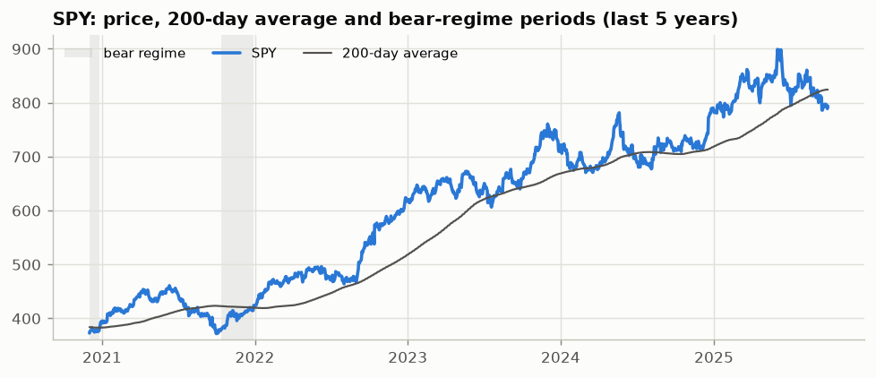
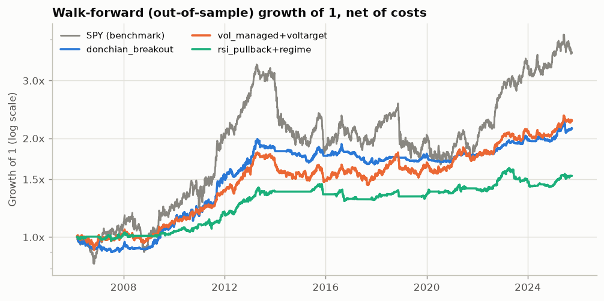
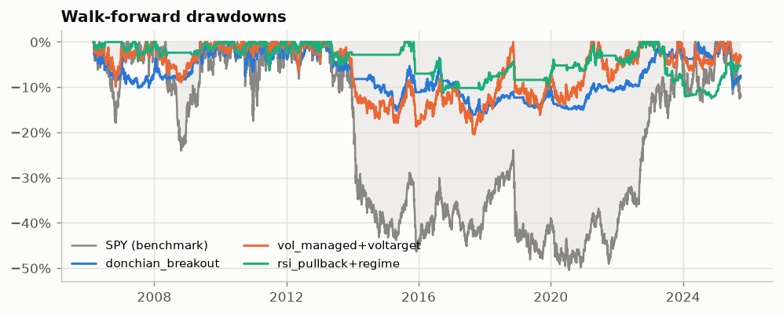
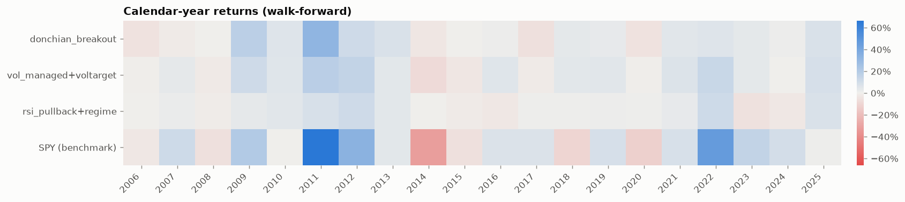
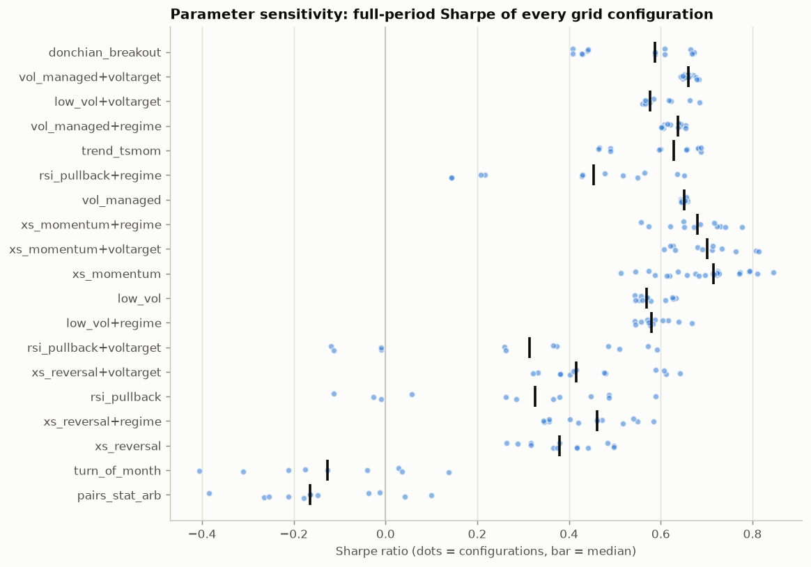
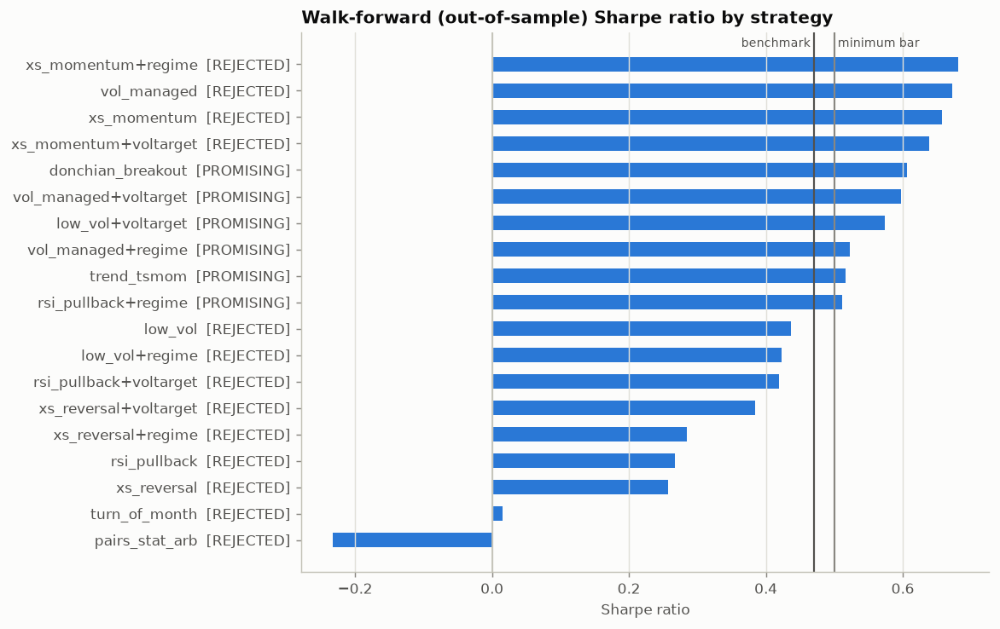
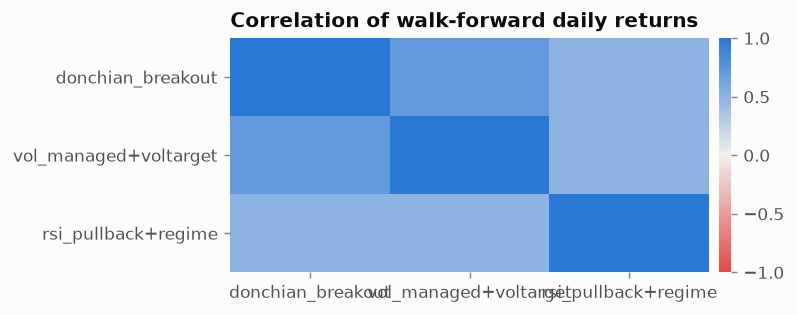

# Trading Strategy Research Report: `us-sectors`

> ⚠️ **SYNTHETIC DATA: results demonstrate the pipeline only and are NOT evidence about any real market.**
>
> ℹ️ Original nine SPDR sector ETFs (XLC and XLRE excluded for history length).

| Item | Value |
|---|---|
| Universe | XLB, XLE, XLF, XLI, XLK, XLP, XLU, XLV, XLY (9 assets) |
| Benchmark | SPY |
| Data | synthetic, 2000-01-03 → 2025-09-30 (6,717 sessions) |
| Costs | us_etf: buy 2.5 bps / sell 2.5 bps per side (commission 0.5, slippage 2, taxes 0/0), sqrt-impact Y=0.5, borrow 30 bps/yr, leverage financing +150 bps/yr |
| Execution | `next_open` · capital 1,000,000 · risk-free 0.0% |
| Validation | IS/OOS split at 2018-05-15; walk-forward 5.0y train / 1.0y test (rolling), 20 windows |
| Trials | 246 parameter configurations across 19 strategy variants |
| Generated | 2026-09-30 in 85s by `tradelab` |

## 1. Executive Summary

**19 strategy variants** (9 base strategies + 10 iteration variants) were researched on 9 assets, testing **246 parameter configurations** in total. Result: **0 validated**, **6 promising**, **13 rejected**.

Benchmark (SPY) over the same walk-forward period: CAGR 6.6%, Sharpe 0.47, max drawdown 50.4%.

**Top strategies (walk-forward, out-of-sample, net of costs):**

1. **donchian_breakout** (🟡 PROMISING): Breakout (price-channel trend). Sharpe 0.61 vs 0.47, CAGR 3.8%, max DD 16.4%, deflated Sharpe 0.29.
2. **vol_managed+voltarget** (🟡 PROMISING): Volatility timing (risk management as a return source) + voltarget overlay. Sharpe 0.60 vs 0.47, CAGR 4.1%, max DD 20.5%, deflated Sharpe 0.28.
3. **rsi_pullback+regime** (🟡 PROMISING): Short-term mean reversion (buy the dip in an uptrend) + regime overlay. Sharpe 0.51 vs 0.47, CAGR 2.1%, max DD 12.5%, deflated Sharpe 0.17.

An equal-risk blend of the selected strategies returned Sharpe 0.69, CAGR 3.0%, max DD 10.5% out of sample.

**Key findings**

- Best out-of-sample Sharpe: **xs_momentum+regime** at 0.68 (benchmark 0.47).
- Median walk-forward Sharpe was **69% of the in-sample Sharpe**, which shows how much a naive in-sample backtest overstates the edge.
- Cost-fragile (Sharpe falls by more than half at 2x costs): turn_of_month.
- After a multiple-testing haircut for 246 trials, 0 variant(s) have deflated Sharpe ≥ 0.9.
- All strategies passed the look-ahead truncation test.
- Current market regime (2025-09-30): **sideways** trend, **high vol** (21-day vol 17.0%).

## 2. Market Analysis

### 2.1 Current regime: facts

| Metric | Value |
|---|---|
| As of | 2025-09-30 |
| Trend regime | sideways |
| Volatility regime | high vol |
| Return 1m / 3m / 6m / 12m | -2.6% / -1.8% / -4.6% / 11.0% |
| Distance from 200-day SMA | -3.7% |
| 50-day SMA above 200-day | no |
| Drawdown from high | -11.7% |
| Realised vol 21d (3y median) | 17.0% (13.7%) |
| Vol percentile (3y) | 76% |
| Breadth: above 200d / 50d SMA | 33% / 56% |
| Avg pairwise correlation 63d (3y pct) | 0.35 (69%) |
| Cross-sectional dispersion (3m) | 14.2% |



### 2.2 Interpretation (heuristic, not evidence)

- Trend is ambiguous (price and the 200-day average disagree). Range-bound conditions tend to cause whipsaws for trend rules and favour mean reversion.

### 2.3 Opportunity scan

| asset | ret_1m | ret_3m | ret_6m | ret_12m | rel_strength_6m | vol_3m | dist_52w_high | rsi14 | above_200d | z_1m_move | volume_trend | flags | momentum_rank |
|---|---|---|---|---|---|---|---|---|---|---|---|---|---|
| XLK | 2.3% | 30.5% | 31.5% | 98.6% | 36.1% | 33.8% | -1.1% | 56 | True | 0.09 | 0.98 | at 52w high | 1 |
| XLI | 25.4% | 12.2% | 8.8% | 60.6% | 13.4% | 40.9% | -5.3% | 68 | True | 2.88 | 0.92 | unusual strength | 2 |
| XLF | 11.5% | 19.7% | 18.5% | 20.0% | 23.1% | 28.3% | 0.0% | 65 | True | 1.28 | 0.94 | at 52w high | 2 |
| XLV | -3.9% | -0.5% | -2.2% | 23.1% | 2.4% | 26.3% | -17.8% | 46 | False | -0.67 | 1.00 |  | 4 |
| XLB | -5.4% | -9.8% | -4.3% | 16.8% | 0.3% | 22.5% | -23.1% | 36 | False | -0.85 | 1.03 |  | 5 |
| XLY | -3.4% | -7.5% | -8.2% | 10.0% | -3.6% | 18.5% | -18.1% | 43 | False | -0.47 | 1.00 |  | 5 |
| XLE | 2.3% | -4.2% | -12.3% | -1.0% | -7.7% | 29.1% | -21.8% | 55 | False | 0.14 | 1.08 |  | 7 |
| XLP | 0.5% | 2.5% | -19.1% | -48.2% | -14.5% | 30.5% | -46.7% | 48 | False | -0.04 | 0.91 | broken trend | 8 |
| XLU | 2.5% | -9.5% | -18.5% | 9.3% | -13.9% | 20.3% | -21.2% | 48 | False | 0.33 | 0.92 |  | 9 |

Flagged assets:

- **XLK**: at 52w high
- **XLI**: unusual strength
- **XLF**: at 52w high
- **XLP**: broken trend

### 2.4 Macro context

_Macro series not available for this data source. Rates, the dollar, oil and VIX are fetched automatically only with `--source yahoo`. Fundamentals, options flow and news are **not** used by this framework, so treat them as unassessed._

### 2.5 Data quality

| ticker | status | first | last | observations | missing_sessions | max_abs_daily_move | flags |
|---|---|---|---|---|---|---|---|
| XLB | ok | 2000-01-03 | 2025-09-30 | 6717 | 0 | 13.2% |  |
| XLE | ok | 2000-01-03 | 2025-09-30 | 6717 | 0 | 12.1% |  |
| XLF | ok | 2000-01-03 | 2025-09-30 | 6717 | 0 | 21.6% |  |
| XLI | ok | 2000-01-03 | 2025-09-30 | 6717 | 0 | 14.7% |  |
| XLK | ok | 2000-01-03 | 2025-09-30 | 6717 | 0 | 15.1% |  |
| XLP | ok | 2000-01-03 | 2025-09-30 | 6717 | 0 | 18.8% |  |
| XLU | ok | 2000-01-03 | 2025-09-30 | 6717 | 0 | 7.4% |  |
| XLV | ok | 2000-01-03 | 2025-09-30 | 6717 | 0 | 10.6% |  |
| XLY | ok | 2000-01-03 | 2025-09-30 | 6717 | 0 | 13.8% |  |
| SPY | ok | 2000-01-03 | 2025-09-30 | 6717 | 0 | 8.3% |  |

## 3. Strategy Details

### 3.1 donchian_breakout: 🟡 PROMISING

*Breakout (price-channel trend)*

- **Thesis / why the edge might exist:** A close beyond the recent trading range signals new information or a shift in supply/demand that the market has not yet fully priced; asymmetric exits (a shorter exit channel) cut losers quickly and let winners run, producing positively skewed payoffs. This is the classic Turtle rule set.
- **Rules:** Enter long when the close exceeds the highest high of the prior `entry` sessions; exit when the close falls below the lowest low of the prior `exit` sessions.
- **Position sizing:** Position size fixed at entry: `vol_target`/N divided by the asset's 63-day volatility, capped at 100% per asset and 100% gross.
- **Rebalance:** Event driven: trades only on breakout entries and channel exits.
- **Universe:** XLB, XLE, XLF, XLI, XLK, XLP, XLU, XLV, XLY (long-only)
- **Parameter grid:** `entry` ∈ [20, 55, 100]; `exit` ∈ [10, 20, 50]; `vol_target` ∈ [0.1, 0.2] (15 configurations)
- **In-sample choice:** `entry=100`, `exit=50`, `vol_target=0.2`, `vol_window=63`, `max_gross=1.0`
- **Deployed (latest walk-forward window):** `entry=55`, `exit=50`, `vol_target=0.2`, `vol_window=63`, `max_gross=1.0`
- **Invalidation:** Breakouts that systematically fail (false breakouts > ~65% with no fat right tail) or a win/loss size ratio that collapses below ~1.5 out of sample.
- **References:** Donchian (1960); Faith (2007), 'Way of the Turtle'; Brock, Lakonishok & LeBaron (1992), 'Simple Technical Trading Rules', JF
- **Code:** [`trend.py` → `DonchianBreakout`](../../tradelab/strategies/trend.py)

### 3.2 vol_managed+voltarget: 🟡 PROMISING

*Volatility timing (risk management as a return source) + voltarget overlay*. Iteration of vol_managed (failed: Max drawdown).

- **Thesis / why the edge might exist:** Volatility clusters and is forecastable, while expected returns do not rise proportionally when volatility spikes. Scaling exposure inversely to recent variance therefore improves risk-adjusted returns and shrinks crash exposure. The edge comes from risk timing, not from direction. OVERLAY: Portfolio volatility targeting: scale the whole book to `port_vol` annualised volatility using the trailing 63-day volatility of the base book (max 1.0x, 10% steps). Addresses deep drawdowns and volatility clustering.
- **Rules:** Always long; exposure = min(max_leverage, vol_target / realised vol) per asset, in 10% steps. Portfolio volatility targeting: scale the whole book to `port_vol` annualised volatility using the trailing 63-day volatility of the base book (max 1.0x, 10% steps). Addresses deep drawdowns and volatility clustering.
- **Position sizing:** Equal risk budget per asset (1/N of the scaled exposure); leverage only if max_leverage > 1.
- **Rebalance:** Weekly (every 5 sessions); exposure quantised to 10% steps to limit churn.
- **Universe:** XLB, XLE, XLF, XLI, XLK, XLP, XLU, XLV, XLY (long-only)
- **Parameter grid:** `vol_window` ∈ [21, 63]; `vol_target` ∈ [0.1, 0.15, 0.2]; `port_vol` ∈ [0.08, 0.12] (13 configurations)
- **In-sample choice:** `vol_target=0.2`, `vol_window=63`, `max_leverage=1.0`, `rebalance=5`, `port_vol=0.12`
- **Deployed (latest walk-forward window):** `vol_target=0.15`, `vol_window=21`, `max_leverage=1.0`, `rebalance=5`, `port_vol=0.08`
- **Invalidation:** Out-of-sample Sharpe no better than buy-and-hold, or losses concentrated in fast 'vol-of-vol' spikes where exposure is cut only after the damage (e.g. single-day crashes).
- **References:** Moreira & Muir (2017), 'Volatility-Managed Portfolios', JF; Harvey et al. (2018), 'The Impact of Volatility Targeting', JPM
- **Code:** [`trend.py` → `VolatilityManaged`](../../tradelab/strategies/trend.py) + overlay in [`overlays.py`](../../tradelab/strategies/overlays.py)

### 3.3 low_vol+voltarget: 🟡 PROMISING

*Defensive / low-volatility anomaly + voltarget overlay*. Iteration of low_vol (failed: Max drawdown, Sharpe minus benchmark Sharpe, Walk-forward Sharpe). Not selected: >80% correlated with vol_managed+voltarget.

- **Thesis / why the edge might exist:** Low-risk assets have historically delivered similar or higher returns than high-risk assets, contradicting CAPM. Explanations: leverage-constrained investors bid up high-beta assets, benchmark-hugging managers avoid low-beta ones, and investors overpay for lottery-like upside. OVERLAY: Portfolio volatility targeting: scale the whole book to `port_vol` annualised volatility using the trailing 63-day volatility of the base book (max 1.0x, 10% steps). Addresses deep drawdowns and volatility clustering.
- **Rules:** Hold the `frac` of assets with the lowest `vol_window`-day realised volatility. Portfolio volatility targeting: scale the whole book to `port_vol` annualised volatility using the trailing 63-day volatility of the base book (max 1.0x, 10% steps). Addresses deep drawdowns and volatility clustering.
- **Position sizing:** Equal weight or inverse-volatility weight among the selected assets; fully invested.
- **Rebalance:** Every `rebalance` trading days (monthly by default).
- **Universe:** XLB, XLE, XLF, XLI, XLK, XLP, XLU, XLV, XLY (long-only)
- **Parameter grid:** `vol_window` ∈ [63, 126, 252]; `frac` ∈ [0.33, 0.5]; `port_vol` ∈ [0.08, 0.12] (12 configurations)
- **In-sample choice:** `vol_window=63`, `frac=0.5`, `weighting=inverse_vol`, `rebalance=21`, `port_vol=0.08`
- **Deployed (latest walk-forward window):** `vol_window=63`, `frac=0.5`, `weighting=inverse_vol`, `rebalance=21`, `port_vol=0.08`
- **Invalidation:** Underperformance driven by rate shocks (low-vol assets are bond proxies) or crowding: if the strategy's drawdowns stop being smaller than the benchmark's out of sample, the defensive premise fails.
- **References:** Frazzini & Pedersen (2014), 'Betting Against Beta', JFE; Baker, Bradley & Wurgler (2011), 'Benchmarks as Limits to Arbitrage', FAJ
- **Code:** [`cross_sectional.py` → `LowVolatility`](../../tradelab/strategies/cross_sectional.py) + overlay in [`overlays.py`](../../tradelab/strategies/overlays.py)

### 3.4 vol_managed+regime: 🟡 PROMISING

*Volatility timing (risk management as a return source) + regime overlay*. Iteration of vol_managed (failed: Max drawdown). Not selected: a higher-ranked variant of vol_managed (vol_managed+voltarget) was chosen.

- **Thesis / why the edge might exist:** Volatility clusters and is forecastable, while expected returns do not rise proportionally when volatility spikes. Scaling exposure inversely to recent variance therefore improves risk-adjusted returns and shrinks crash exposure. The edge comes from risk timing, not from direction. OVERLAY: Market regime filter: only hold positions while the benchmark trades above its `regime_sma`-day moving average (2% hysteresis band). Addresses drawdowns concentrated in bear markets.
- **Rules:** Always long; exposure = min(max_leverage, vol_target / realised vol) per asset, in 10% steps. Market regime filter: only hold positions while the benchmark trades above its `regime_sma`-day moving average (2% hysteresis band). Addresses drawdowns concentrated in bear markets.
- **Position sizing:** Equal risk budget per asset (1/N of the scaled exposure); leverage only if max_leverage > 1.
- **Rebalance:** Weekly (every 5 sessions); exposure quantised to 10% steps to limit churn.
- **Universe:** XLB, XLE, XLF, XLI, XLK, XLP, XLU, XLV, XLY (long-only)
- **Parameter grid:** `vol_window` ∈ [21, 63]; `vol_target` ∈ [0.1, 0.15, 0.2]; `regime_sma` ∈ [150, 200] (13 configurations)
- **In-sample choice:** `vol_target=0.2`, `vol_window=63`, `max_leverage=1.0`, `rebalance=5`, `regime_sma=200`
- **Deployed (latest walk-forward window):** `vol_target=0.2`, `vol_window=63`, `max_leverage=1.0`, `rebalance=5`, `regime_sma=200`
- **Invalidation:** Out-of-sample Sharpe no better than buy-and-hold, or losses concentrated in fast 'vol-of-vol' spikes where exposure is cut only after the damage (e.g. single-day crashes).
- **References:** Moreira & Muir (2017), 'Volatility-Managed Portfolios', JF; Harvey et al. (2018), 'The Impact of Volatility Targeting', JPM
- **Code:** [`trend.py` → `VolatilityManaged`](../../tradelab/strategies/trend.py) + overlay in [`overlays.py`](../../tradelab/strategies/overlays.py)

### 3.5 trend_tsmom: 🟡 PROMISING

*Trend following (time-series momentum)*. Not selected: >80% correlated with donchian_breakout.

- **Thesis / why the edge might exist:** Prices trend because information diffuses slowly, investors under-react and then herd, and risk-transfer flows (hedging, deleveraging, rebalancing) persist for weeks to months. Time-series momentum is documented across asset classes over a century of data and tends to profit in prolonged bear markets, which makes it a diversifier rather than a pure return engine.
- **Rules:** Long an asset when its trailing `lookback`-day total return is positive; flat otherwise (short instead if `allow_short`).
- **Position sizing:** Inverse volatility: each asset targets `vol_target`/N annualised vol from a 63-day estimate; gross exposure capped at 100% (no leverage).
- **Rebalance:** Every `rebalance` trading days.
- **Universe:** XLB, XLE, XLF, XLI, XLK, XLP, XLU, XLV, XLY (long-only)
- **Parameter grid:** `lookback` ∈ [63, 126, 252]; `vol_target` ∈ [0.1, 0.15]; `rebalance` ∈ [5, 21] (12 configurations)
- **In-sample choice:** `lookback=63`, `vol_target=0.15`, `rebalance=21`, `vol_window=63`, `allow_short=False`, `max_gross=1.0`
- **Deployed (latest walk-forward window):** `lookback=63`, `vol_target=0.15`, `rebalance=5`, `vol_window=63`, `allow_short=False`, `max_gross=1.0`
- **Invalidation:** Persistent whipsaw losses in range-bound markets with sharp V-shaped reversals; several years of negative out-of-sample returns during markets that did trend would falsify the premise.
- **References:** Moskowitz, Ooi & Pedersen (2012), 'Time Series Momentum', JFE; Hurst, Ooi & Pedersen (2017), 'A Century of Evidence on Trend-Following Investing'
- **Code:** [`trend.py` → `TimeSeriesMomentum`](../../tradelab/strategies/trend.py)

### 3.6 rsi_pullback+regime: 🟡 PROMISING

*Short-term mean reversion (buy the dip in an uptrend) + regime overlay*. Iteration of rsi_pullback (failed: Positive calendar years, Sharpe minus benchmark Sharpe, Walk-forward Sharpe).

- **Thesis / why the edge might exist:** Short-horizon selling pressure (stop-outs, forced liquidations, over-reaction to noise) pushes prices below fair value for a few days; within an established uptrend these dips tend to be bought. The trend filter avoids catching falling knives in bear markets. OVERLAY: Market regime filter: only hold positions while the benchmark trades above its `regime_sma`-day moving average (2% hysteresis band). Addresses drawdowns concentrated in bear markets.
- **Rules:** Enter long when RSI(`rsi_len`) < `entry` and close > `trend_len`-day SMA; exit when RSI > `exit` or after `max_hold` sessions. Market regime filter: only hold positions while the benchmark trades above its `regime_sma`-day moving average (2% hysteresis band). Addresses drawdowns concentrated in bear markets.
- **Position sizing:** 1/N of capital per asset slot; no leverage.
- **Rebalance:** Event driven (signal checked every close).
- **Universe:** XLB, XLE, XLF, XLI, XLK, XLP, XLU, XLV, XLY (long-only)
- **Parameter grid:** `rsi_len` ∈ [2, 3]; `entry` ∈ [5, 10, 20]; `regime_sma` ∈ [150, 200] (12 configurations)
- **In-sample choice:** `rsi_len=2`, `entry=20`, `exit=70`, `trend_len=200`, `max_hold=10`, `regime_sma=200`
- **Deployed (latest walk-forward window):** `rsi_len=2`, `entry=10`, `exit=70`, `trend_len=200`, `max_hold=10`, `regime_sma=200`
- **Invalidation:** If the edge disappears with a one-day execution delay or at 2x costs, it is too thin to trade; a regime of persistent momentum crashes (dips keep falling) invalidates the premise.
- **References:** Connors & Alvarez (2009), 'Short Term Trading Strategies That Work'; Jegadeesh (1990), 'Evidence of Predictable Behavior of Security Returns', JF
- **Code:** [`mean_reversion.py` → `RSIPullback`](../../tradelab/strategies/mean_reversion.py) + overlay in [`overlays.py`](../../tradelab/strategies/overlays.py)

### 3.7 vol_managed: ❌ REJECTED

*Volatility timing (risk management as a return source)*

- **Thesis / why the edge might exist:** Volatility clusters and is forecastable, while expected returns do not rise proportionally when volatility spikes. Scaling exposure inversely to recent variance therefore improves risk-adjusted returns and shrinks crash exposure. The edge comes from risk timing, not from direction.
- **Rules:** Always long; exposure = min(max_leverage, vol_target / realised vol) per asset, in 10% steps.
- **Position sizing:** Equal risk budget per asset (1/N of the scaled exposure); leverage only if max_leverage > 1.
- **Rebalance:** Weekly (every 5 sessions); exposure quantised to 10% steps to limit churn.
- **Universe:** XLB, XLE, XLF, XLI, XLK, XLP, XLU, XLV, XLY (long-only)
- **Parameter grid:** `vol_window` ∈ [21, 63]; `vol_target` ∈ [0.1, 0.15, 0.2]; `max_leverage` ∈ [1.0, 1.5] (13 configurations)
- **In-sample choice:** `vol_target=0.2`, `vol_window=63`, `max_leverage=1.0`, `rebalance=5`
- **Deployed (latest walk-forward window):** `vol_target=0.15`, `vol_window=21`, `max_leverage=1.5`, `rebalance=5`
- **Invalidation:** Out-of-sample Sharpe no better than buy-and-hold, or losses concentrated in fast 'vol-of-vol' spikes where exposure is cut only after the damage (e.g. single-day crashes).
- **References:** Moreira & Muir (2017), 'Volatility-Managed Portfolios', JF; Harvey et al. (2018), 'The Impact of Volatility Targeting', JPM
- **Code:** [`trend.py` → `VolatilityManaged`](../../tradelab/strategies/trend.py)

### 3.8 xs_momentum+regime: ❌ REJECTED

*Relative strength rotation (cross-sectional momentum) + regime overlay*. Iteration of xs_momentum (failed: Max drawdown).

- **Thesis / why the edge might exist:** Assets that outperformed peers over the past 3-12 months tend to keep outperforming for a few months: slow diffusion of sector/industry news, analyst under-reaction and institutional flows chasing performance. Skipping the most recent month avoids the short-term reversal effect. With `abs_filter` it becomes 'dual momentum': only hold winners whose own trend is positive. OVERLAY: Market regime filter: only hold positions while the benchmark trades above its `regime_sma`-day moving average (2% hysteresis band). Addresses drawdowns concentrated in bear markets.
- **Rules:** Rank assets by return from t-`lookback` to t-`skip`; hold the top `top_frac`. With `abs_filter`, a selected asset with a negative score is replaced by cash. Market regime filter: only hold positions while the benchmark trades above its `regime_sma`-day moving average (2% hysteresis band). Addresses drawdowns concentrated in bear markets.
- **Position sizing:** Equal weight across the selected slots; gross exposure <= 100%.
- **Rebalance:** Every `rebalance` trading days (monthly by default).
- **Universe:** XLB, XLE, XLF, XLI, XLK, XLP, XLU, XLV, XLY (long-only)
- **Parameter grid:** `lookback` ∈ [63, 126, 252]; `skip` ∈ [0, 21]; `regime_sma` ∈ [150, 200] (12 configurations)
- **In-sample choice:** `lookback=63`, `skip=0`, `top_frac=0.33`, `abs_filter=False`, `rebalance=21`, `regime_sma=200`
- **Deployed (latest walk-forward window):** `lookback=63`, `skip=0`, `top_frac=0.33`, `abs_filter=False`, `rebalance=21`, `regime_sma=200`
- **Invalidation:** Momentum crashes: violent rebounds of past losers after market bottoms (2009, 2020) - if losses in rebounds dominate and the out-of-sample spread between winners and losers turns negative.
- **References:** Jegadeesh & Titman (1993), 'Returns to Buying Winners and Selling Losers', JF; Moskowitz & Grinblatt (1999), 'Do Industries Explain Momentum?', JF; Antonacci (2014), 'Dual Momentum Investing'
- **Code:** [`cross_sectional.py` → `CrossSectionalMomentum`](../../tradelab/strategies/cross_sectional.py) + overlay in [`overlays.py`](../../tradelab/strategies/overlays.py)

### 3.9 xs_momentum+voltarget: ❌ REJECTED

*Relative strength rotation (cross-sectional momentum) + voltarget overlay*. Iteration of xs_momentum (failed: Max drawdown).

- **Thesis / why the edge might exist:** Assets that outperformed peers over the past 3-12 months tend to keep outperforming for a few months: slow diffusion of sector/industry news, analyst under-reaction and institutional flows chasing performance. Skipping the most recent month avoids the short-term reversal effect. With `abs_filter` it becomes 'dual momentum': only hold winners whose own trend is positive. OVERLAY: Portfolio volatility targeting: scale the whole book to `port_vol` annualised volatility using the trailing 63-day volatility of the base book (max 1.0x, 10% steps). Addresses deep drawdowns and volatility clustering.
- **Rules:** Rank assets by return from t-`lookback` to t-`skip`; hold the top `top_frac`. With `abs_filter`, a selected asset with a negative score is replaced by cash. Portfolio volatility targeting: scale the whole book to `port_vol` annualised volatility using the trailing 63-day volatility of the base book (max 1.0x, 10% steps). Addresses deep drawdowns and volatility clustering.
- **Position sizing:** Equal weight across the selected slots; gross exposure <= 100%.
- **Rebalance:** Every `rebalance` trading days (monthly by default).
- **Universe:** XLB, XLE, XLF, XLI, XLK, XLP, XLU, XLV, XLY (long-only)
- **Parameter grid:** `lookback` ∈ [63, 126, 252]; `skip` ∈ [0, 21]; `port_vol` ∈ [0.08, 0.12] (12 configurations)
- **In-sample choice:** `lookback=63`, `skip=0`, `top_frac=0.33`, `abs_filter=False`, `rebalance=21`, `port_vol=0.12`
- **Deployed (latest walk-forward window):** `lookback=63`, `skip=0`, `top_frac=0.33`, `abs_filter=False`, `rebalance=21`, `port_vol=0.12`
- **Invalidation:** Momentum crashes: violent rebounds of past losers after market bottoms (2009, 2020) - if losses in rebounds dominate and the out-of-sample spread between winners and losers turns negative.
- **References:** Jegadeesh & Titman (1993), 'Returns to Buying Winners and Selling Losers', JF; Moskowitz & Grinblatt (1999), 'Do Industries Explain Momentum?', JF; Antonacci (2014), 'Dual Momentum Investing'
- **Code:** [`cross_sectional.py` → `CrossSectionalMomentum`](../../tradelab/strategies/cross_sectional.py) + overlay in [`overlays.py`](../../tradelab/strategies/overlays.py)

### 3.10 xs_momentum: ❌ REJECTED

*Relative strength rotation (cross-sectional momentum)*

- **Thesis / why the edge might exist:** Assets that outperformed peers over the past 3-12 months tend to keep outperforming for a few months: slow diffusion of sector/industry news, analyst under-reaction and institutional flows chasing performance. Skipping the most recent month avoids the short-term reversal effect. With `abs_filter` it becomes 'dual momentum': only hold winners whose own trend is positive.
- **Rules:** Rank assets by return from t-`lookback` to t-`skip`; hold the top `top_frac`. With `abs_filter`, a selected asset with a negative score is replaced by cash.
- **Position sizing:** Equal weight across the selected slots; gross exposure <= 100%.
- **Rebalance:** Every `rebalance` trading days (monthly by default).
- **Universe:** XLB, XLE, XLF, XLI, XLK, XLP, XLU, XLV, XLY (long-only)
- **Parameter grid:** `lookback` ∈ [63, 126, 252]; `skip` ∈ [0, 21]; `top_frac` ∈ [0.25, 0.5]; `abs_filter` ∈ [False, True] (24 configurations)
- **In-sample choice:** `lookback=63`, `skip=0`, `top_frac=0.25`, `abs_filter=True`, `rebalance=21`
- **Deployed (latest walk-forward window):** `lookback=63`, `skip=0`, `top_frac=0.5`, `abs_filter=False`, `rebalance=21`
- **Invalidation:** Momentum crashes: violent rebounds of past losers after market bottoms (2009, 2020) - if losses in rebounds dominate and the out-of-sample spread between winners and losers turns negative.
- **References:** Jegadeesh & Titman (1993), 'Returns to Buying Winners and Selling Losers', JF; Moskowitz & Grinblatt (1999), 'Do Industries Explain Momentum?', JF; Antonacci (2014), 'Dual Momentum Investing'
- **Code:** [`cross_sectional.py` → `CrossSectionalMomentum`](../../tradelab/strategies/cross_sectional.py)

### 3.11 low_vol: ❌ REJECTED

*Defensive / low-volatility anomaly*

- **Thesis / why the edge might exist:** Low-risk assets have historically delivered similar or higher returns than high-risk assets, contradicting CAPM. Explanations: leverage-constrained investors bid up high-beta assets, benchmark-hugging managers avoid low-beta ones, and investors overpay for lottery-like upside.
- **Rules:** Hold the `frac` of assets with the lowest `vol_window`-day realised volatility.
- **Position sizing:** Equal weight or inverse-volatility weight among the selected assets; fully invested.
- **Rebalance:** Every `rebalance` trading days (monthly by default).
- **Universe:** XLB, XLE, XLF, XLI, XLK, XLP, XLU, XLV, XLY (long-only)
- **Parameter grid:** `vol_window` ∈ [63, 126, 252]; `frac` ∈ [0.33, 0.5]; `weighting` ∈ ['equal', 'inverse_vol'] (12 configurations)
- **In-sample choice:** `vol_window=63`, `frac=0.5`, `weighting=equal`, `rebalance=21`
- **Deployed (latest walk-forward window):** `vol_window=63`, `frac=0.5`, `weighting=equal`, `rebalance=21`
- **Invalidation:** Underperformance driven by rate shocks (low-vol assets are bond proxies) or crowding: if the strategy's drawdowns stop being smaller than the benchmark's out of sample, the defensive premise fails.
- **References:** Frazzini & Pedersen (2014), 'Betting Against Beta', JFE; Baker, Bradley & Wurgler (2011), 'Benchmarks as Limits to Arbitrage', FAJ
- **Code:** [`cross_sectional.py` → `LowVolatility`](../../tradelab/strategies/cross_sectional.py)

### 3.12 low_vol+regime: ❌ REJECTED

*Defensive / low-volatility anomaly + regime overlay*. Iteration of low_vol (failed: Max drawdown, Sharpe minus benchmark Sharpe, Walk-forward Sharpe).

- **Thesis / why the edge might exist:** Low-risk assets have historically delivered similar or higher returns than high-risk assets, contradicting CAPM. Explanations: leverage-constrained investors bid up high-beta assets, benchmark-hugging managers avoid low-beta ones, and investors overpay for lottery-like upside. OVERLAY: Market regime filter: only hold positions while the benchmark trades above its `regime_sma`-day moving average (2% hysteresis band). Addresses drawdowns concentrated in bear markets.
- **Rules:** Hold the `frac` of assets with the lowest `vol_window`-day realised volatility. Market regime filter: only hold positions while the benchmark trades above its `regime_sma`-day moving average (2% hysteresis band). Addresses drawdowns concentrated in bear markets.
- **Position sizing:** Equal weight or inverse-volatility weight among the selected assets; fully invested.
- **Rebalance:** Every `rebalance` trading days (monthly by default).
- **Universe:** XLB, XLE, XLF, XLI, XLK, XLP, XLU, XLV, XLY (long-only)
- **Parameter grid:** `vol_window` ∈ [63, 126, 252]; `frac` ∈ [0.33, 0.5]; `regime_sma` ∈ [150, 200] (12 configurations)
- **In-sample choice:** `vol_window=63`, `frac=0.5`, `weighting=inverse_vol`, `rebalance=21`, `regime_sma=200`
- **Deployed (latest walk-forward window):** `vol_window=63`, `frac=0.5`, `weighting=inverse_vol`, `rebalance=21`, `regime_sma=200`
- **Invalidation:** Underperformance driven by rate shocks (low-vol assets are bond proxies) or crowding: if the strategy's drawdowns stop being smaller than the benchmark's out of sample, the defensive premise fails.
- **References:** Frazzini & Pedersen (2014), 'Betting Against Beta', JFE; Baker, Bradley & Wurgler (2011), 'Benchmarks as Limits to Arbitrage', FAJ
- **Code:** [`cross_sectional.py` → `LowVolatility`](../../tradelab/strategies/cross_sectional.py) + overlay in [`overlays.py`](../../tradelab/strategies/overlays.py)

### 3.13 rsi_pullback+voltarget: ❌ REJECTED

*Short-term mean reversion (buy the dip in an uptrend) + voltarget overlay*. Iteration of rsi_pullback (failed: Positive calendar years, Sharpe minus benchmark Sharpe, Walk-forward Sharpe).

- **Thesis / why the edge might exist:** Short-horizon selling pressure (stop-outs, forced liquidations, over-reaction to noise) pushes prices below fair value for a few days; within an established uptrend these dips tend to be bought. The trend filter avoids catching falling knives in bear markets. OVERLAY: Portfolio volatility targeting: scale the whole book to `port_vol` annualised volatility using the trailing 63-day volatility of the base book (max 1.0x, 10% steps). Addresses deep drawdowns and volatility clustering.
- **Rules:** Enter long when RSI(`rsi_len`) < `entry` and close > `trend_len`-day SMA; exit when RSI > `exit` or after `max_hold` sessions. Portfolio volatility targeting: scale the whole book to `port_vol` annualised volatility using the trailing 63-day volatility of the base book (max 1.0x, 10% steps). Addresses deep drawdowns and volatility clustering.
- **Position sizing:** 1/N of capital per asset slot; no leverage.
- **Rebalance:** Event driven (signal checked every close).
- **Universe:** XLB, XLE, XLF, XLI, XLK, XLP, XLU, XLV, XLY (long-only)
- **Parameter grid:** `rsi_len` ∈ [2, 3]; `entry` ∈ [5, 10, 20]; `port_vol` ∈ [0.08, 0.12] (12 configurations)
- **In-sample choice:** `rsi_len=2`, `entry=20`, `exit=70`, `trend_len=200`, `max_hold=10`, `port_vol=0.12`
- **Deployed (latest walk-forward window):** `rsi_len=2`, `entry=20`, `exit=70`, `trend_len=200`, `max_hold=10`, `port_vol=0.12`
- **Invalidation:** If the edge disappears with a one-day execution delay or at 2x costs, it is too thin to trade; a regime of persistent momentum crashes (dips keep falling) invalidates the premise.
- **References:** Connors & Alvarez (2009), 'Short Term Trading Strategies That Work'; Jegadeesh (1990), 'Evidence of Predictable Behavior of Security Returns', JF
- **Code:** [`mean_reversion.py` → `RSIPullback`](../../tradelab/strategies/mean_reversion.py) + overlay in [`overlays.py`](../../tradelab/strategies/overlays.py)

### 3.14 xs_reversal+voltarget: ❌ REJECTED

*Short-term reversal (liquidity provision) + voltarget overlay*. Iteration of xs_reversal (failed: Max drawdown, Sharpe minus benchmark Sharpe, Walk-forward Sharpe).

- **Thesis / why the edge might exist:** Over days to a few weeks, the biggest relative losers tend to bounce: prices overshoot when liquidity-demanding traders push them, and the reversal is the compensation earned by liquidity providers. The edge is well documented but small per trade and cost-sensitive. OVERLAY: Portfolio volatility targeting: scale the whole book to `port_vol` annualised volatility using the trailing 63-day volatility of the base book (max 1.0x, 10% steps). Addresses deep drawdowns and volatility clustering.
- **Rules:** Every `rebalance` sessions, buy the bottom `bottom_frac` of assets by `lookback`-day return. Portfolio volatility targeting: scale the whole book to `port_vol` annualised volatility using the trailing 63-day volatility of the base book (max 1.0x, 10% steps). Addresses deep drawdowns and volatility clustering.
- **Position sizing:** Equal weight across the selected losers; gross exposure <= 100%.
- **Rebalance:** Every `rebalance` trading days.
- **Universe:** XLB, XLE, XLF, XLI, XLK, XLP, XLU, XLV, XLY (long-only)
- **Parameter grid:** `lookback` ∈ [5, 10, 21]; `bottom_frac` ∈ [0.2, 0.33]; `port_vol` ∈ [0.08, 0.12] (13 configurations)
- **In-sample choice:** `lookback=10`, `bottom_frac=0.33`, `rebalance=5`, `port_vol=0.08`
- **Deployed (latest walk-forward window):** `lookback=5`, `bottom_frac=0.2`, `rebalance=5`, `port_vol=0.08`
- **Invalidation:** Edge vanishing after realistic costs (net Sharpe < 0.3 at 2x costs), or losers continuing to lose (reversal turning into momentum) out of sample.
- **References:** Lehmann (1990), 'Fads, Martingales, and Market Efficiency', QJE; Nagel (2012), 'Evaporating Liquidity', RFS
- **Code:** [`cross_sectional.py` → `CrossSectionalReversal`](../../tradelab/strategies/cross_sectional.py) + overlay in [`overlays.py`](../../tradelab/strategies/overlays.py)

### 3.15 rsi_pullback: ❌ REJECTED

*Short-term mean reversion (buy the dip in an uptrend)*

- **Thesis / why the edge might exist:** Short-horizon selling pressure (stop-outs, forced liquidations, over-reaction to noise) pushes prices below fair value for a few days; within an established uptrend these dips tend to be bought. The trend filter avoids catching falling knives in bear markets.
- **Rules:** Enter long when RSI(`rsi_len`) < `entry` and close > `trend_len`-day SMA; exit when RSI > `exit` or after `max_hold` sessions.
- **Position sizing:** 1/N of capital per asset slot; no leverage.
- **Rebalance:** Event driven (signal checked every close).
- **Universe:** XLB, XLE, XLF, XLI, XLK, XLP, XLU, XLV, XLY (long-only)
- **Parameter grid:** `rsi_len` ∈ [2, 3]; `entry` ∈ [5, 10, 20]; `exit` ∈ [50, 70] (12 configurations)
- **In-sample choice:** `rsi_len=2`, `entry=20`, `exit=70`, `trend_len=200`, `max_hold=10`
- **Deployed (latest walk-forward window):** `rsi_len=2`, `entry=20`, `exit=50`, `trend_len=200`, `max_hold=10`
- **Invalidation:** If the edge disappears with a one-day execution delay or at 2x costs, it is too thin to trade; a regime of persistent momentum crashes (dips keep falling) invalidates the premise.
- **References:** Connors & Alvarez (2009), 'Short Term Trading Strategies That Work'; Jegadeesh (1990), 'Evidence of Predictable Behavior of Security Returns', JF
- **Code:** [`mean_reversion.py` → `RSIPullback`](../../tradelab/strategies/mean_reversion.py)

### 3.16 xs_reversal+regime: ❌ REJECTED

*Short-term reversal (liquidity provision) + regime overlay*. Iteration of xs_reversal (failed: Max drawdown, Sharpe minus benchmark Sharpe, Walk-forward Sharpe).

- **Thesis / why the edge might exist:** Over days to a few weeks, the biggest relative losers tend to bounce: prices overshoot when liquidity-demanding traders push them, and the reversal is the compensation earned by liquidity providers. The edge is well documented but small per trade and cost-sensitive. OVERLAY: Market regime filter: only hold positions while the benchmark trades above its `regime_sma`-day moving average (2% hysteresis band). Addresses drawdowns concentrated in bear markets.
- **Rules:** Every `rebalance` sessions, buy the bottom `bottom_frac` of assets by `lookback`-day return. Market regime filter: only hold positions while the benchmark trades above its `regime_sma`-day moving average (2% hysteresis band). Addresses drawdowns concentrated in bear markets.
- **Position sizing:** Equal weight across the selected losers; gross exposure <= 100%.
- **Rebalance:** Every `rebalance` trading days.
- **Universe:** XLB, XLE, XLF, XLI, XLK, XLP, XLU, XLV, XLY (long-only)
- **Parameter grid:** `lookback` ∈ [5, 10, 21]; `bottom_frac` ∈ [0.2, 0.33]; `regime_sma` ∈ [150, 200] (13 configurations)
- **In-sample choice:** `lookback=10`, `bottom_frac=0.2`, `rebalance=5`, `regime_sma=200`
- **Deployed (latest walk-forward window):** `lookback=5`, `bottom_frac=0.2`, `rebalance=5`, `regime_sma=150`
- **Invalidation:** Edge vanishing after realistic costs (net Sharpe < 0.3 at 2x costs), or losers continuing to lose (reversal turning into momentum) out of sample.
- **References:** Lehmann (1990), 'Fads, Martingales, and Market Efficiency', QJE; Nagel (2012), 'Evaporating Liquidity', RFS
- **Code:** [`cross_sectional.py` → `CrossSectionalReversal`](../../tradelab/strategies/cross_sectional.py) + overlay in [`overlays.py`](../../tradelab/strategies/overlays.py)

### 3.17 xs_reversal: ❌ REJECTED

*Short-term reversal (liquidity provision)*

- **Thesis / why the edge might exist:** Over days to a few weeks, the biggest relative losers tend to bounce: prices overshoot when liquidity-demanding traders push them, and the reversal is the compensation earned by liquidity providers. The edge is well documented but small per trade and cost-sensitive.
- **Rules:** Every `rebalance` sessions, buy the bottom `bottom_frac` of assets by `lookback`-day return.
- **Position sizing:** Equal weight across the selected losers; gross exposure <= 100%.
- **Rebalance:** Every `rebalance` trading days.
- **Universe:** XLB, XLE, XLF, XLI, XLK, XLP, XLU, XLV, XLY (long-only)
- **Parameter grid:** `lookback` ∈ [5, 10, 21]; `bottom_frac` ∈ [0.2, 0.33]; `rebalance` ∈ [5, 10] (13 configurations)
- **In-sample choice:** `lookback=10`, `bottom_frac=0.33`, `rebalance=5`
- **Deployed (latest walk-forward window):** `lookback=5`, `bottom_frac=0.2`, `rebalance=5`
- **Invalidation:** Edge vanishing after realistic costs (net Sharpe < 0.3 at 2x costs), or losers continuing to lose (reversal turning into momentum) out of sample.
- **References:** Lehmann (1990), 'Fads, Martingales, and Market Efficiency', QJE; Nagel (2012), 'Evaporating Liquidity', RFS
- **Code:** [`cross_sectional.py` → `CrossSectionalReversal`](../../tradelab/strategies/cross_sectional.py)

### 3.18 turn_of_month: ❌ REJECTED

*Calendar / flow-driven event effect*

- **Thesis / why the edge might exist:** Equity returns cluster around the turn of the month: salaries, pension contributions and fund inflows are invested on predictable dates, and institutions window-dress before month end. The strategy is invested only a fraction of the time, so it earns a large share of the market's return with far less exposure.
- **Rules:** Long during the last `days_before` and first `days_after` business days of each month; cash otherwise.
- **Position sizing:** Equal weight across available assets; fully invested inside the window, flat outside.
- **Rebalance:** Calendar driven: two trades per month.
- **Universe:** XLB, XLE, XLF, XLI, XLK, XLP, XLU, XLV, XLY (long-only)
- **Parameter grid:** `days_before` ∈ [1, 2, 3]; `days_after` ∈ [1, 3, 5] (9 configurations)
- **In-sample choice:** `days_before=3`, `days_after=5`
- **Deployed (latest walk-forward window):** `days_before=2`, `days_after=5`
- **Invalidation:** Well-known calendar anomalies can be arbitraged away after publication; if the in-window average daily return is no longer higher than out-of-window returns in the walk-forward period, drop it.
- **References:** Ariel (1987), 'A Monthly Effect in Stock Returns', JFE; Lakonishok & Smidt (1988), 'Are Seasonal Anomalies Real?', RFS; McConnell & Xu (2008), 'Equity Returns at the Turn of the Month', FAJ
- **Code:** [`calendar.py` → `TurnOfMonth`](../../tradelab/strategies/calendar.py)

### 3.19 pairs_stat_arb: ❌ REJECTED

*Statistical arbitrage (pairs / market neutral)*

- **Thesis / why the edge might exist:** Economically linked assets (same industry, same risk drivers) share a long-run equilibrium; temporary divergences caused by idiosyncratic flows tend to close. Trading the spread earns a liquidity-provision premium with little market beta, diversifying directional strategies.
- **Rules:** Every `reform` sessions, pick up to `n_pairs` disjoint pairs whose log-price hedge residual over the past `formation` sessions has an ADF t-stat below `max_adf_t`. Trade the spread when its `z_window`-day z-score exceeds +/-`entry_z`; exit when it reverts inside `exit_z`. Open positions are closed at the end of each trading period.
- **Position sizing:** Each pair gets 1/`n_pairs` of gross capital, split long/short by the hedge ratio (dollar neutral-ish).
- **Rebalance:** Pair formation every `reform` sessions; signals checked every close.
- **Universe:** XLB, XLE, XLF, XLI, XLK, XLP, XLU, XLV, XLY (long/short)
- **Parameter grid:** `z_window` ∈ [20, 60]; `entry_z` ∈ [1.5, 2.0, 2.5]; `exit_z` ∈ [0.0, 0.5] (12 configurations)
- **In-sample choice:** `formation=252`, `reform=63`, `n_pairs=3`, `z_window=20`, `entry_z=1.5`, `exit_z=0.5`, `max_adf_t=-3.0`
- **Deployed (latest walk-forward window):** `formation=252`, `reform=63`, `n_pairs=3`, `z_window=20`, `entry_z=2.5`, `exit_z=0.5`, `max_adf_t=-3.0`
- **Invalidation:** Structural breaks (mergers, regulation, business-model change) that permanently decouple a pair; if out-of-sample spreads stop reverting (losing trades hit the period end rather than exit_z).
- **References:** Gatev, Goetzmann & Rouwenhorst (2006), 'Pairs Trading', RFS; Engle & Granger (1987), 'Co-integration and Error Correction', Econometrica
- **Code:** [`pairs.py` → `PairsTrading`](../../tradelab/strategies/pairs.py)

## 4. Backtest Results

### 4.1 How to read these numbers

- **Walk-forward (primary evidence):** parameters are re-chosen every 1.0y using only the previous 5.0y, then traded on unseen data. The stitched test periods (2006-02-26 → 2025-09-30) are the out-of-sample record. Switching costs between parameter sets are charged.
- Parameter choice favours stable *plateaus* in parameter space over isolated peaks.
- Signals use the close of day *t*; trades execute `next_open`. Costs, impact, borrow and financing are included. Idle cash earns the configured risk-free rate.
- Win rate and profit factor are measured per position spell (entry to exit, per asset).

### 4.2 Walk-forward performance (top strategies)

| Metric | donchian_breakout | vol_managed+voltarget | rsi_pullback+regime | SPY (benchmark) | Equal-weight buy & hold |
|---|---|---|---|---|---|
| Total return | 114.7% | 126.8% | 53.6% | 265.4% | 394.7% |
| CAGR | 3.8% | 4.1% | 2.1% | 6.6% | 8.2% |
| Volatility | 6.6% | 7.2% | 4.3% | 16.5% | 20.6% |
| Sharpe | 0.61 | 0.60 | 0.51 | 0.47 | 0.49 |
| Sortino | 0.89 | 0.87 | 0.76 | 0.68 | 0.70 |
| Max drawdown | 16.4% | 20.5% | 12.5% | 50.4% | 66.1% |
| Calmar | 0.23 | 0.20 | 0.17 | 0.13 | 0.12 |
| Win rate (trades) | 45.1% | n/a | 69.5% | n/a | n/a |
| Profit factor | 2.07 | n/a | 1.33 | n/a | n/a |
| Trades | 273 | 9 | 1192 | 0 | 9 |
| Avg holding (bars) | 72.0 | 5111.0 | 4.8 | n/a | 6716.0 |
| Turnover / yr | 2.0x | 2.6x | 13.3x | n/a | 0.0x |
| Cost drag / yr | 0.1% | 0.1% | 0.4% | n/a | 0.0% |
| Time in market | 90.2% | 100.0% | 45.8% | n/a | 100.0% |
| Beta | 0.26 | 0.36 | 0.11 | n/a | 1.08 |
| Positive years | 70.0% | 65.0% | 70.0% | 70.0% | 60.0% |
| Worst year | -5.9% | -7.8% | -5.7% | -31.8% | -29.2% |
| CVaR 95% (daily) | 1.0% | 1.0% | 0.7% | 2.4% | 2.9% |





### 4.3 All strategies: in-sample vs out-of-sample (overfitting check)

| strategy | IS Sharpe | OOS Sharpe (IS params) | Walk-forward Sharpe | WF CAGR | WF max DD | WF Sortino | Win rate | Profit factor | Turnover/yr |
|---|---|---|---|---|---|---|---|---|---|
| donchian_breakout | 0.62 | 0.78 | 0.61 | 3.8% | 16.4% | 0.89 | 45.1% | 2.07 | 2.0x |
| vol_managed+voltarget | 0.72 | 0.58 | 0.60 | 4.1% | 20.5% | 0.87 | n/a | n/a | 2.6x |
| low_vol+voltarget | 0.71 | 0.62 | 0.57 | 4.8% | 27.0% | 0.83 | 56.2% | 2.62 | 3.3x |
| vol_managed+regime | 0.66 | 0.65 | 0.52 | 3.9% | 20.7% | 0.74 | 41.3% | 2.25 | 3.1x |
| trend_tsmom | 0.75 | 0.45 | 0.52 | 3.0% | 26.3% | 0.74 | 39.8% | 1.82 | 2.2x |
| rsi_pullback+regime | 0.77 | 0.35 | 0.51 | 2.1% | 12.5% | 0.76 | 69.5% | 1.33 | 13.3x |
| vol_managed | 0.71 | 0.53 | 0.67 | 6.5% | 31.2% | 0.98 | n/a | n/a | 2.5x |
| xs_momentum+regime | 0.80 | 0.72 | 0.68 | 11.3% | 40.3% | 1.01 | 51.0% | 1.90 | 8.1x |
| xs_momentum+voltarget | 0.83 | 0.78 | 0.64 | 5.9% | 31.0% | 0.94 | 52.4% | 2.04 | 4.6x |
| xs_momentum | 0.87 | 0.79 | 0.66 | 12.0% | 44.7% | 0.98 | 46.6% | 1.98 | 6.3x |
| low_vol | 0.68 | 0.53 | 0.44 | 6.7% | 54.4% | 0.63 | 54.3% | 1.99 | 3.7x |
| low_vol+regime | 0.67 | 0.67 | 0.42 | 5.3% | 45.4% | 0.61 | 43.4% | 1.62 | 5.6x |
| rsi_pullback+voltarget | 0.66 | 0.43 | 0.42 | 2.0% | 21.6% | 0.61 | 68.9% | 1.21 | 17.0x |
| xs_reversal+voltarget | 0.71 | 0.37 | 0.38 | 3.1% | 30.4% | 0.55 | 58.1% | 1.17 | 24.4x |
| rsi_pullback | 0.66 | 0.43 | 0.27 | 1.1% | 21.9% | 0.39 | 68.8% | 1.14 | 15.7x |
| xs_reversal+regime | 0.61 | 0.53 | 0.28 | 3.6% | 57.1% | 0.41 | 57.4% | 1.13 | 43.8x |
| xs_reversal | 0.60 | 0.26 | 0.26 | 3.3% | 63.6% | 0.37 | 57.7% | 1.10 | 57.8x |
| turn_of_month | 0.04 | 0.38 | 0.02 | -0.4% | 59.6% | 0.02 | 50.2% | 0.98 | 23.3x |
| pairs_stat_arb | 0.17 | -0.11 | -0.23 | -1.2% | 36.6% | -0.31 | 55.2% | 0.88 | 8.3x |

### 4.4 Calendar-year returns (walk-forward)



| index | donchian_breakout | vol_managed+voltarget | rsi_pullback+regime | SPY (benchmark) |
|---|---|---|---|---|
| 2006.00 | -5.1% | -0.6% | 0.3% | -2.7% |
| 2007.00 | -1.8% | 3.2% | 2.0% | 11.7% |
| 2008.00 | -0.3% | -2.4% | -1.5% | -6.1% |
| 2009.00 | 17.6% | 11.1% | 3.1% | 20.3% |
| 2010.00 | 6.0% | 5.6% | 5.2% | 0.4% |
| 2011.00 | 32.0% | 18.1% | 8.2% | 66.4% |
| 2012.00 | 11.2% | 15.4% | 11.2% | 33.4% |
| 2013.00 | 7.6% | 4.2% | 4.5% | 4.5% |
| 2014.00 | -3.5% | -7.8% | 0.0% | -31.8% |
| 2015.00 | 0.0% | -3.5% | -1.9% | -5.8% |
| 2016.00 | 1.1% | 5.5% | -3.1% | 7.0% |
| 2017.00 | -5.9% | -1.6% | 0.7% | 7.2% |
| 2018.00 | 3.8% | 4.4% | 0.9% | -10.1% |
| 2019.00 | 2.8% | 4.7% | 1.5% | 8.3% |
| 2020.00 | -4.9% | -0.9% | 0.8% | -12.1% |
| 2021.00 | 4.9% | 6.4% | 2.8% | 8.3% |
| 2022.00 | 5.8% | 13.3% | 11.8% | 46.5% |
| 2023.00 | 4.1% | 3.9% | -5.7% | 15.3% |
| 2024.00 | 1.1% | -0.3% | -2.9% | 9.9% |
| 2025.00 | 7.7% | 8.7% | 7.4% | 1.0% |

### 4.5 Robustness checks

**Parameter sensitivity:** is the result a plateau or a spike?



| strategy | grid_size | best_sharpe | median_sharpe | median_to_best | frac_positive | is_oos_rank_corr |
|---|---|---|---|---|---|---|
| donchian_breakout | 15 | 0.67 | 0.59 | 0.87 | 100.0% | 0.61 |
| vol_managed+voltarget | 13 | 0.68 | 0.66 | 0.97 | 100.0% | -0.71 |
| low_vol+voltarget | 12 | 0.68 | 0.58 | 0.84 | 100.0% | 0.06 |
| vol_managed+regime | 13 | 0.65 | 0.64 | 0.97 | 100.0% | 0.00 |
| trend_tsmom | 12 | 0.69 | 0.63 | 0.91 | 100.0% | 0.57 |
| rsi_pullback+regime | 12 | 0.65 | 0.45 | 0.70 | 100.0% | 0.86 |
| vol_managed | 13 | 0.66 | 0.65 | 0.99 | 100.0% | -0.71 |
| xs_momentum+regime | 12 | 0.78 | 0.68 | 0.87 | 100.0% | 0.48 |
| xs_momentum+voltarget | 12 | 0.81 | 0.70 | 0.86 | 100.0% | 0.66 |
| xs_momentum | 24 | 0.85 | 0.71 | 0.85 | 100.0% | 0.34 |
| low_vol | 12 | 0.63 | 0.57 | 0.90 | 100.0% | 0.12 |
| low_vol+regime | 12 | 0.67 | 0.58 | 0.87 | 100.0% | 0.08 |
| rsi_pullback+voltarget | 12 | 0.59 | 0.31 | 0.53 | 66.7% | 0.98 |
| xs_reversal+voltarget | 13 | 0.64 | 0.42 | 0.65 | 100.0% | 0.61 |
| rsi_pullback | 12 | 0.59 | 0.33 | 0.55 | 75.0% | 0.77 |
| xs_reversal+regime | 13 | 0.58 | 0.46 | 0.79 | 100.0% | 0.42 |
| xs_reversal | 13 | 0.50 | 0.38 | 0.76 | 100.0% | 0.48 |
| turn_of_month | 9 | 0.14 | -0.13 | 0.00 | 33.3% | 0.93 |
| pairs_stat_arb | 12 | 0.10 | -0.16 | 0.00 | 16.7% | 0.11 |

**Stress tests** (walk-forward Sharpe under harsher assumptions):

| strategy | base | costs x2 | costs x3 | +1 session delay | same-close (optimistic) |
|---|---|---|---|---|---|
| donchian_breakout | 0.61 | 0.60 | 0.59 | 0.62 | 0.60 |
| vol_managed+voltarget | 0.60 | 0.59 | 0.58 | 0.60 | 0.61 |
| low_vol+voltarget | 0.57 | 0.56 | 0.55 | 0.58 | 0.58 |
| vol_managed+regime | 0.52 | 0.51 | 0.50 | 0.54 | 0.53 |
| trend_tsmom | 0.52 | 0.51 | 0.50 | 0.53 | 0.52 |
| rsi_pullback+regime | 0.51 | 0.42 | 0.33 | 0.31 | 0.59 |
| vol_managed | 0.67 | 0.66 | 0.66 | 0.68 | 0.68 |
| xs_momentum+regime | 0.68 | 0.66 | 0.65 | 0.68 | 0.69 |
| xs_momentum+voltarget | 0.64 | 0.62 | 0.61 | 0.64 | 0.65 |
| xs_momentum | 0.66 | 0.65 | 0.64 | 0.65 | 0.66 |
| low_vol | 0.44 | 0.43 | 0.42 | 0.44 | 0.44 |
| low_vol+regime | 0.42 | 0.41 | 0.40 | 0.43 | 0.41 |
| rsi_pullback+voltarget | 0.42 | 0.32 | 0.22 | 0.25 | 0.49 |
| xs_reversal+voltarget | 0.38 | 0.30 | 0.22 | 0.32 | 0.38 |
| rsi_pullback | 0.27 | 0.17 | 0.07 | 0.18 | 0.32 |
| xs_reversal+regime | 0.28 | 0.20 | 0.12 | 0.16 | 0.31 |
| xs_reversal | 0.26 | 0.17 | 0.09 | 0.24 | 0.24 |
| turn_of_month | 0.02 | -0.05 | -0.11 | 0.07 | -0.02 |
| pairs_stat_arb | -0.23 | -0.29 | -0.35 | -0.26 | -0.24 |

**Regime dependence** (walk-forward, annualised return / Sharpe by benchmark regime):

*donchian_breakout*

| dimension | regime | share_of_time | ann_return | sharpe | benchmark_ann_return | benchmark_sharpe |
|---|---|---|---|---|---|---|
| trend | bear | 25.8% | -3.0% | -0.90 | -8.6% | -0.50 |
| trend | bull | 58.2% | 8.1% | 1.06 | 21.0% | 1.37 |
| trend | sideways | 16.0% | 0.2% | 0.03 | -14.2% | -0.75 |
| vol | high vol | 35.9% | 2.4% | 0.31 | 0.6% | 0.03 |
| vol | low vol | 32.6% | 5.2% | 0.99 | 10.6% | 0.97 |
| vol | normal vol | 31.5% | 4.5% | 0.72 | 13.0% | 0.92 |

*vol_managed+voltarget*

| dimension | regime | share_of_time | ann_return | sharpe | benchmark_ann_return | benchmark_sharpe |
|---|---|---|---|---|---|---|
| trend | bear | 25.8% | -2.4% | -0.33 | -8.6% | -0.50 |
| trend | bull | 58.2% | 9.6% | 1.37 | 21.0% | 1.37 |
| trend | sideways | 16.0% | -4.0% | -0.51 | -14.2% | -0.75 |
| vol | high vol | 35.9% | 1.1% | 0.14 | 0.6% | 0.03 |
| vol | low vol | 32.6% | 7.4% | 1.11 | 10.6% | 0.97 |
| vol | normal vol | 31.5% | 4.6% | 0.68 | 13.0% | 0.92 |

*rsi_pullback+regime*

| dimension | regime | share_of_time | ann_return | sharpe | benchmark_ann_return | benchmark_sharpe |
|---|---|---|---|---|---|---|
| trend | bear | 25.8% | -0.6% | -0.45 | -8.6% | -0.50 |
| trend | bull | 58.2% | 4.6% | 0.86 | 21.0% | 1.37 |
| trend | sideways | 16.0% | -1.9% | -0.55 | -14.2% | -0.75 |
| vol | high vol | 35.9% | 0.9% | 0.19 | 0.6% | 0.03 |
| vol | low vol | 32.6% | 2.5% | 0.63 | 10.6% | 0.97 |
| vol | normal vol | 31.5% | 3.4% | 0.82 | 13.0% | 0.92 |

**Crisis and drawdown episodes:**

*donchian_breakout*

| episode | strategy | benchmark |
|---|---|---|
| Benchmark drawdown 2013-04-08 -> 2020-07-20 | -13.5% | -49.8% |
| Benchmark drawdown 2008-05-07 -> 2008-10-23 | -1.2% | -23.6% |
| Benchmark drawdown 2006-03-01 -> 2006-11-01 | -8.1% | -17.0% |

*vol_managed+voltarget*

| episode | strategy | benchmark |
|---|---|---|
| Benchmark drawdown 2013-04-08 -> 2020-07-20 | -11.8% | -49.8% |
| Benchmark drawdown 2008-05-07 -> 2008-10-23 | -6.7% | -23.6% |
| Benchmark drawdown 2006-03-01 -> 2006-11-01 | -8.9% | -17.0% |

*rsi_pullback+regime*

| episode | strategy | benchmark |
|---|---|---|
| Benchmark drawdown 2013-04-08 -> 2020-07-20 | -1.3% | -49.8% |
| Benchmark drawdown 2008-05-07 -> 2008-10-23 | -0.7% | -23.6% |
| Benchmark drawdown 2006-03-01 -> 2006-11-01 | 0.3% | -17.0% |

**Asset concentration** (share of positive P&L from the single best asset; Sharpe with the most important asset removed):

| strategy | top asset | top asset P&L share | leave-one-out min Sharpe | most important asset |
|---|---|---|---|---|
| donchian_breakout | XLK | 24.6% | 0.52 | XLK |
| vol_managed+voltarget | XLK | 15.9% | 0.56 | XLK |
| low_vol+voltarget | XLV | 24.1% | 0.50 | XLE |
| vol_managed+regime | XLE | 16.1% | 0.49 | XLE |
| trend_tsmom | XLK | 19.6% | 0.47 | XLK |
| rsi_pullback+regime | XLV | 28.6% | 0.41 | XLV |
| vol_managed | XLK | 16.1% | 0.63 | XLK |
| xs_momentum+regime | XLK | 20.5% | 0.60 | XLF |
| xs_momentum+voltarget | XLK | 33.2% | 0.48 | XLK |
| xs_momentum | XLK | 30.4% | 0.53 | XLK |
| low_vol | XLV | 27.7% | 0.36 | XLE |
| low_vol+regime | XLU | 27.0% | 0.36 | XLE |
| rsi_pullback+voltarget | XLK | 35.2% | 0.30 | XLK |
| xs_reversal+voltarget | XLE | 31.2% | 0.28 | XLE |
| rsi_pullback | XLK | 43.7% | 0.11 | XLK |
| xs_reversal+regime | XLI | 41.8% | 0.17 | XLI |
| xs_reversal | XLP | 28.0% | 0.20 | XLE |
| turn_of_month | XLP | 51.4% | -0.03 | XLP |
| pairs_stat_arb | XLP | 52.1% | -0.32 | XLP |

### 4.6 Statistical significance

Probabilistic Sharpe (PSR) is P(true Sharpe > 0). The deflated Sharpe (DSR) also discounts for the best-of-246-trials selection effect (cross-trial Sharpe dispersion 0.26 annualised). The 95% CI comes from a stationary block bootstrap.

| strategy | WF Sharpe | 95% CI | t-stat | PSR | DSR |
|---|---|---|---|---|---|
| donchian_breakout | 0.61 | [0.19, 0.98] | 2.73 | 1.00 | 0.29 |
| vol_managed+voltarget | 0.60 | [0.15, 1.03] | 2.69 | 1.00 | 0.28 |
| low_vol+voltarget | 0.57 | [0.13, 0.98] | 2.58 | 1.00 | 0.25 |
| vol_managed+regime | 0.52 | [0.11, 0.95] | 2.35 | 0.99 | 0.18 |
| trend_tsmom | 0.52 | [0.05, 0.97] | 2.33 | 0.99 | 0.17 |
| rsi_pullback+regime | 0.51 | [0.06, 0.95] | 2.30 | 0.99 | 0.17 |
| vol_managed | 0.67 | [0.22, 1.11] | 3.02 | 1.00 | 0.40 |
| xs_momentum+regime | 0.68 | [0.28, 1.12] | 3.07 | 1.00 | 0.42 |
| xs_momentum+voltarget | 0.64 | [0.20, 1.07] | 2.88 | 1.00 | 0.35 |
| xs_momentum | 0.66 | [0.25, 1.13] | 2.96 | 1.00 | 0.38 |
| low_vol | 0.44 | [-0.03, 0.85] | 1.96 | 0.98 | 0.10 |
| low_vol+regime | 0.42 | [-0.07, 0.86] | 1.91 | 0.97 | 0.09 |
| rsi_pullback+voltarget | 0.42 | [-0.04, 0.88] | 1.89 | 0.97 | 0.08 |
| xs_reversal+voltarget | 0.38 | [-0.09, 0.83] | 1.73 | 0.96 | 0.06 |
| rsi_pullback | 0.27 | [-0.20, 0.74] | 1.21 | 0.89 | 0.02 |
| xs_reversal+regime | 0.28 | [-0.16, 0.70] | 1.28 | 0.90 | 0.02 |
| xs_reversal | 0.26 | [-0.20, 0.68] | 1.16 | 0.88 | 0.02 |
| turn_of_month | 0.02 | [-0.37, 0.37] | 0.07 | 0.53 | 0.00 |
| pairs_stat_arb | -0.23 | [-0.61, 0.17] | -1.05 | 0.14 | 0.00 |

## 5. Comparison & Ranking

Ranking: verdict first (VALIDATED > PROMISING > REJECTED), then a 0-100 score weighting out-of-sample Sharpe (30), deflated Sharpe (15), parameter robustness (10), drawdown (10), cost resilience (10), excess Sharpe vs benchmark (10), yearly consistency (5), regime consistency (5) and diversification across assets (5).

| rank | strategy | status | score | wf_sharpe | wf_cagr | wf_max_dd | benchmark_sharpe | dsr | psr | robustness | cost_x2_sharpe | annual_turnover | main_issue |
|---|---|---|---|---|---|---|---|---|---|---|---|---|---|
| 1 | donchian_breakout | 🟡 PROMISING | 58.8 | 0.61 | 3.8% | 16.4% | 0.47 | 0.29 | 1.00 | 0.87 | 0.60 | 2.0x | Deflated Sharpe (multiple-testing adjusted) (0.29 vs >= 0.9) |
| 2 | vol_managed+voltarget | 🟡 PROMISING | 56.9 | 0.60 | 4.1% | 20.5% | 0.47 | 0.28 | 1.00 | 0.97 | 0.59 | 2.6x | Deflated Sharpe (multiple-testing adjusted) (0.28 vs >= 0.9) |
| 3 | low_vol+voltarget | 🟡 PROMISING | 53.0 | 0.57 | 4.8% | 27.0% | 0.47 | 0.25 | 1.00 | 0.84 | 0.56 | 3.3x | Deflated Sharpe (multiple-testing adjusted) (0.25 vs >= 0.9) |
| 4 | vol_managed+regime | 🟡 PROMISING | 52.9 | 0.52 | 3.9% | 20.7% | 0.47 | 0.18 | 0.99 | 0.97 | 0.51 | 3.1x | Deflated Sharpe (multiple-testing adjusted) (0.18 vs >= 0.9) |
| 5 | trend_tsmom | 🟡 PROMISING | 50.8 | 0.52 | 3.0% | 26.3% | 0.47 | 0.17 | 0.99 | 0.91 | 0.51 | 2.2x | Deflated Sharpe (multiple-testing adjusted) (0.17 vs >= 0.9) |
| 6 | rsi_pullback+regime | 🟡 PROMISING | 49.6 | 0.51 | 2.1% | 12.5% | 0.47 | 0.17 | 0.99 | 0.70 | 0.42 | 13.3x | Deflated Sharpe (multiple-testing adjusted) (0.17 vs >= 0.9) |
| 7 | vol_managed | ❌ REJECTED | 59.2 | 0.67 | 6.5% | 31.2% | 0.47 | 0.40 | 1.00 | 0.99 | 0.66 | 2.5x | Max drawdown (31.2% vs < 30%) |
| 8 | xs_momentum+regime | ❌ REJECTED | 58.2 | 0.68 | 11.3% | 40.3% | 0.47 | 0.42 | 1.00 | 0.87 | 0.66 | 8.1x | Max drawdown (40.3% vs < 30%) |
| 9 | xs_momentum+voltarget | ❌ REJECTED | 55.9 | 0.64 | 5.9% | 31.0% | 0.47 | 0.35 | 1.00 | 0.86 | 0.62 | 4.6x | Max drawdown (31.0% vs < 30%) |
| 10 | xs_momentum | ❌ REJECTED | 53.9 | 0.66 | 12.0% | 44.7% | 0.47 | 0.38 | 1.00 | 0.85 | 0.65 | 6.3x | Max drawdown (44.7% vs < 30%) |
| 11 | low_vol | ❌ REJECTED | 42.2 | 0.44 | 6.7% | 54.4% | 0.47 | 0.10 | 0.98 | 0.90 | 0.43 | 3.7x | Walk-forward Sharpe (0.44 vs >= 0.5) |
| 12 | low_vol+regime | ❌ REJECTED | 42.2 | 0.42 | 5.3% | 45.4% | 0.47 | 0.09 | 0.97 | 0.87 | 0.41 | 5.6x | Walk-forward Sharpe (0.42 vs >= 0.5) |
| 13 | rsi_pullback+voltarget | ❌ REJECTED | 40.4 | 0.42 | 2.0% | 21.6% | 0.47 | 0.08 | 0.97 | 0.53 | 0.32 | 17.0x | Walk-forward Sharpe (0.42 vs >= 0.5) |
| 14 | xs_reversal+voltarget | ❌ REJECTED | 39.3 | 0.38 | 3.1% | 30.4% | 0.47 | 0.06 | 0.96 | 0.65 | 0.30 | 24.4x | Walk-forward Sharpe (0.38 vs >= 0.5) |
| 15 | rsi_pullback | ❌ REJECTED | 33.0 | 0.27 | 1.1% | 21.9% | 0.47 | 0.02 | 0.89 | 0.55 | 0.17 | 15.7x | Walk-forward Sharpe (0.27 vs >= 0.5) |
| 16 | xs_reversal+regime | ❌ REJECTED | 31.2 | 0.28 | 3.6% | 57.1% | 0.47 | 0.02 | 0.90 | 0.79 | 0.20 | 43.8x | Walk-forward Sharpe (0.28 vs >= 0.5) |
| 17 | xs_reversal | ❌ REJECTED | 30.6 | 0.26 | 3.3% | 63.6% | 0.47 | 0.02 | 0.88 | 0.76 | 0.17 | 57.8x | Walk-forward Sharpe (0.26 vs >= 0.5) |
| 18 | turn_of_month | ❌ REJECTED | 7.4 | 0.02 | -0.4% | 59.6% | 0.47 | 0.00 | 0.53 | 0.00 | -0.05 | 23.3x | Walk-forward Sharpe (0.02 vs >= 0.5) |
| 19 | pairs_stat_arb | ❌ REJECTED | 6.6 | -0.23 | -1.2% | 36.6% | 0.47 | 0.00 | 0.14 | 0.00 | -0.29 | 8.3x | Walk-forward Sharpe (-0.23 vs >= 0.5) |



### Pros and cons

**donchian_breakout** (🟡 PROMISING, score 58.8)

- ➕ Walk-forward Sharpe; Sharpe minus benchmark Sharpe; Max drawdown; Positive calendar years; Cost resilience (Sharpe at 2x costs / base); No look-ahead bias (truncation test); Liquidity (max share of ADV traded); Parameter robustness (median/best grid Sharpe); Single-asset P&L share; Survives 1-session execution delay; In-sample -> walk-forward decay
- ➖ Deflated Sharpe (multiple-testing adjusted) (0.29 vs >= 0.9); Preferred Sharpe (0.61 vs >= 1.0); CAGR minus benchmark CAGR (-2.8% vs > 0); Positive Sharpe across trend regimes (66.7% vs >= 67% of regimes)

**vol_managed+voltarget** (🟡 PROMISING, score 56.9)

- ➕ Walk-forward Sharpe; Sharpe minus benchmark Sharpe; Max drawdown; Positive calendar years; Cost resilience (Sharpe at 2x costs / base); No look-ahead bias (truncation test); Liquidity (max share of ADV traded); Parameter robustness (median/best grid Sharpe); Single-asset P&L share; Survives 1-session execution delay; In-sample -> walk-forward decay
- ➖ Deflated Sharpe (multiple-testing adjusted) (0.28 vs >= 0.9); Preferred Sharpe (0.60 vs >= 1.0); CAGR minus benchmark CAGR (-2.5% vs > 0); Positive Sharpe across trend regimes (33.3% vs >= 67% of regimes)

**low_vol+voltarget** (🟡 PROMISING, score 53.0)

- ➕ Walk-forward Sharpe; Sharpe minus benchmark Sharpe; Max drawdown; Positive calendar years; Cost resilience (Sharpe at 2x costs / base); No look-ahead bias (truncation test); Liquidity (max share of ADV traded); Parameter robustness (median/best grid Sharpe); Single-asset P&L share; Survives 1-session execution delay; In-sample -> walk-forward decay
- ➖ Deflated Sharpe (multiple-testing adjusted) (0.25 vs >= 0.9); Preferred Sharpe (0.57 vs >= 1.0); CAGR minus benchmark CAGR (-1.8% vs > 0); Positive Sharpe across trend regimes (33.3% vs >= 67% of regimes)

**vol_managed+regime** (🟡 PROMISING, score 52.9)

- ➕ Walk-forward Sharpe; Sharpe minus benchmark Sharpe; Max drawdown; Positive calendar years; Cost resilience (Sharpe at 2x costs / base); No look-ahead bias (truncation test); Liquidity (max share of ADV traded); Parameter robustness (median/best grid Sharpe); Single-asset P&L share; Survives 1-session execution delay; In-sample -> walk-forward decay
- ➖ Deflated Sharpe (multiple-testing adjusted) (0.18 vs >= 0.9); Preferred Sharpe (0.52 vs >= 1.0); CAGR minus benchmark CAGR (-2.7% vs > 0); Positive Sharpe across trend regimes (33.3% vs >= 67% of regimes)

**trend_tsmom** (🟡 PROMISING, score 50.8)

- ➕ Walk-forward Sharpe; Sharpe minus benchmark Sharpe; Max drawdown; Positive calendar years; Cost resilience (Sharpe at 2x costs / base); No look-ahead bias (truncation test); Liquidity (max share of ADV traded); Parameter robustness (median/best grid Sharpe); Single-asset P&L share; Survives 1-session execution delay; In-sample -> walk-forward decay
- ➖ Deflated Sharpe (multiple-testing adjusted) (0.17 vs >= 0.9); Preferred Sharpe (0.52 vs >= 1.0); CAGR minus benchmark CAGR (-3.6% vs > 0); Positive Sharpe across trend regimes (33.3% vs >= 67% of regimes)

**rsi_pullback+regime** (🟡 PROMISING, score 49.6)

- ➕ Walk-forward Sharpe; Sharpe minus benchmark Sharpe; Max drawdown; Positive calendar years; Cost resilience (Sharpe at 2x costs / base); No look-ahead bias (truncation test); Liquidity (max share of ADV traded); Parameter robustness (median/best grid Sharpe); Single-asset P&L share; Survives 1-session execution delay; In-sample -> walk-forward decay
- ➖ Deflated Sharpe (multiple-testing adjusted) (0.17 vs >= 0.9); Preferred Sharpe (0.51 vs >= 1.0); CAGR minus benchmark CAGR (-4.5% vs > 0); Positive Sharpe across trend regimes (33.3% vs >= 67% of regimes)

**vol_managed** (❌ REJECTED, score 59.2)

- ➕ Walk-forward Sharpe; Sharpe minus benchmark Sharpe; Positive calendar years; Cost resilience (Sharpe at 2x costs / base); No look-ahead bias (truncation test); Liquidity (max share of ADV traded); Parameter robustness (median/best grid Sharpe); Single-asset P&L share; Survives 1-session execution delay; In-sample -> walk-forward decay
- ➖ Max drawdown (31.2% vs < 30%); Deflated Sharpe (multiple-testing adjusted) (0.40 vs >= 0.9); Preferred Sharpe (0.67 vs >= 1.0); CAGR minus benchmark CAGR (-0.1% vs > 0); Positive Sharpe across trend regimes (33.3% vs >= 67% of regimes)

**xs_momentum+regime** (❌ REJECTED, score 58.2)

- ➕ Walk-forward Sharpe; Sharpe minus benchmark Sharpe; Positive calendar years; Cost resilience (Sharpe at 2x costs / base); No look-ahead bias (truncation test); Liquidity (max share of ADV traded); Parameter robustness (median/best grid Sharpe); CAGR minus benchmark CAGR; Single-asset P&L share; Survives 1-session execution delay; In-sample -> walk-forward decay
- ➖ Max drawdown (40.3% vs < 30%); Deflated Sharpe (multiple-testing adjusted) (0.42 vs >= 0.9); Preferred Sharpe (0.68 vs >= 1.0); Positive Sharpe across trend regimes (66.7% vs >= 67% of regimes)

**xs_momentum+voltarget** (❌ REJECTED, score 55.9)

- ➕ Walk-forward Sharpe; Sharpe minus benchmark Sharpe; Positive calendar years; Cost resilience (Sharpe at 2x costs / base); No look-ahead bias (truncation test); Liquidity (max share of ADV traded); Parameter robustness (median/best grid Sharpe); Single-asset P&L share; Survives 1-session execution delay; In-sample -> walk-forward decay
- ➖ Max drawdown (31.0% vs < 30%); Deflated Sharpe (multiple-testing adjusted) (0.35 vs >= 0.9); Preferred Sharpe (0.64 vs >= 1.0); CAGR minus benchmark CAGR (-0.7% vs > 0); Positive Sharpe across trend regimes (33.3% vs >= 67% of regimes)

**xs_momentum** (❌ REJECTED, score 53.9)

- ➕ Walk-forward Sharpe; Sharpe minus benchmark Sharpe; Positive calendar years; Cost resilience (Sharpe at 2x costs / base); No look-ahead bias (truncation test); Liquidity (max share of ADV traded); Parameter robustness (median/best grid Sharpe); CAGR minus benchmark CAGR; Single-asset P&L share; Survives 1-session execution delay; In-sample -> walk-forward decay
- ➖ Max drawdown (44.7% vs < 30%); Deflated Sharpe (multiple-testing adjusted) (0.38 vs >= 0.9); Preferred Sharpe (0.66 vs >= 1.0); Positive Sharpe across trend regimes (33.3% vs >= 67% of regimes)

**low_vol** (❌ REJECTED, score 42.2)

- ➕ Positive calendar years; Cost resilience (Sharpe at 2x costs / base); No look-ahead bias (truncation test); Liquidity (max share of ADV traded); Parameter robustness (median/best grid Sharpe); CAGR minus benchmark CAGR; Single-asset P&L share; Survives 1-session execution delay; In-sample -> walk-forward decay
- ➖ Walk-forward Sharpe (0.44 vs >= 0.5); Sharpe minus benchmark Sharpe (-0.03 vs > 0); Max drawdown (54.4% vs < 30%); Deflated Sharpe (multiple-testing adjusted) (0.10 vs >= 0.9); Preferred Sharpe (0.44 vs >= 1.0); Positive Sharpe across trend regimes (33.3% vs >= 67% of regimes)

**low_vol+regime** (❌ REJECTED, score 42.2)

- ➕ Positive calendar years; Cost resilience (Sharpe at 2x costs / base); No look-ahead bias (truncation test); Liquidity (max share of ADV traded); Parameter robustness (median/best grid Sharpe); Single-asset P&L share; Survives 1-session execution delay; In-sample -> walk-forward decay
- ➖ Walk-forward Sharpe (0.42 vs >= 0.5); Sharpe minus benchmark Sharpe (-0.05 vs > 0); Max drawdown (45.4% vs < 30%); Deflated Sharpe (multiple-testing adjusted) (0.09 vs >= 0.9); Preferred Sharpe (0.42 vs >= 1.0); CAGR minus benchmark CAGR (-1.3% vs > 0); Positive Sharpe across trend regimes (33.3% vs >= 67% of regimes)

**rsi_pullback+voltarget** (❌ REJECTED, score 40.4)

- ➕ Max drawdown; Positive calendar years; Cost resilience (Sharpe at 2x costs / base); No look-ahead bias (truncation test); Liquidity (max share of ADV traded); Parameter robustness (median/best grid Sharpe); Single-asset P&L share; Survives 1-session execution delay; In-sample -> walk-forward decay
- ➖ Walk-forward Sharpe (0.42 vs >= 0.5); Sharpe minus benchmark Sharpe (-0.05 vs > 0); Deflated Sharpe (multiple-testing adjusted) (0.08 vs >= 0.9); Preferred Sharpe (0.42 vs >= 1.0); CAGR minus benchmark CAGR (-4.6% vs > 0); Positive Sharpe across trend regimes (33.3% vs >= 67% of regimes)

**xs_reversal+voltarget** (❌ REJECTED, score 39.3)

- ➕ Positive calendar years; Cost resilience (Sharpe at 2x costs / base); No look-ahead bias (truncation test); Liquidity (max share of ADV traded); Parameter robustness (median/best grid Sharpe); Single-asset P&L share; Survives 1-session execution delay; In-sample -> walk-forward decay
- ➖ Walk-forward Sharpe (0.38 vs >= 0.5); Sharpe minus benchmark Sharpe (-0.09 vs > 0); Max drawdown (30.4% vs < 30%); Deflated Sharpe (multiple-testing adjusted) (0.06 vs >= 0.9); Preferred Sharpe (0.38 vs >= 1.0); CAGR minus benchmark CAGR (-3.5% vs > 0); Positive Sharpe across trend regimes (33.3% vs >= 67% of regimes)

**rsi_pullback** (❌ REJECTED, score 33.0)

- ➕ Max drawdown; Cost resilience (Sharpe at 2x costs / base); No look-ahead bias (truncation test); Liquidity (max share of ADV traded); Parameter robustness (median/best grid Sharpe); Single-asset P&L share; Survives 1-session execution delay
- ➖ Walk-forward Sharpe (0.27 vs >= 0.5); Sharpe minus benchmark Sharpe (-0.20 vs > 0); Positive calendar years (50.0% vs >= 55%); Deflated Sharpe (multiple-testing adjusted) (0.02 vs >= 0.9); Preferred Sharpe (0.27 vs >= 1.0); CAGR minus benchmark CAGR (-5.5% vs > 0); Positive Sharpe across trend regimes (33.3% vs >= 67% of regimes); In-sample -> walk-forward decay (0.41 vs >= 0.5)

**xs_reversal+regime** (❌ REJECTED, score 31.2)

- ➕ Cost resilience (Sharpe at 2x costs / base); No look-ahead bias (truncation test); Liquidity (max share of ADV traded); Parameter robustness (median/best grid Sharpe); Single-asset P&L share; Survives 1-session execution delay
- ➖ Walk-forward Sharpe (0.28 vs >= 0.5); Sharpe minus benchmark Sharpe (-0.19 vs > 0); Max drawdown (57.1% vs < 30%); Positive calendar years (50.0% vs >= 55%); Deflated Sharpe (multiple-testing adjusted) (0.02 vs >= 0.9); Preferred Sharpe (0.28 vs >= 1.0); CAGR minus benchmark CAGR (-3.0% vs > 0); Positive Sharpe across trend regimes (33.3% vs >= 67% of regimes); In-sample -> walk-forward decay (0.47 vs >= 0.5)

**xs_reversal** (❌ REJECTED, score 30.6)

- ➕ Positive calendar years; Cost resilience (Sharpe at 2x costs / base); No look-ahead bias (truncation test); Liquidity (max share of ADV traded); Parameter robustness (median/best grid Sharpe); Single-asset P&L share; Survives 1-session execution delay
- ➖ Walk-forward Sharpe (0.26 vs >= 0.5); Sharpe minus benchmark Sharpe (-0.21 vs > 0); Max drawdown (63.6% vs < 30%); Deflated Sharpe (multiple-testing adjusted) (0.02 vs >= 0.9); Preferred Sharpe (0.26 vs >= 1.0); CAGR minus benchmark CAGR (-3.3% vs > 0); Positive Sharpe across trend regimes (33.3% vs >= 67% of regimes); In-sample -> walk-forward decay (0.43 vs >= 0.5)

**turn_of_month** (❌ REJECTED, score 7.4)

- ➕ No look-ahead bias (truncation test); Liquidity (max share of ADV traded); Single-asset P&L share; Survives 1-session execution delay
- ➖ Walk-forward Sharpe (0.02 vs >= 0.5); Sharpe minus benchmark Sharpe (-0.45 vs > 0); Max drawdown (59.6% vs < 30%); Positive calendar years (50.0% vs >= 55%); Cost resilience (Sharpe at 2x costs / base) (-3.20 vs >= 0.5); Deflated Sharpe (multiple-testing adjusted) (0.00 vs >= 0.9); Parameter robustness (median/best grid Sharpe) (0.00 vs >= 0.5); Preferred Sharpe (0.02 vs >= 1.0); CAGR minus benchmark CAGR (-7.0% vs > 0); Positive Sharpe across trend regimes (33.3% vs >= 67% of regimes); In-sample -> walk-forward decay (0.37 vs >= 0.5)

**pairs_stat_arb** (❌ REJECTED, score 6.6)

- ➕ No look-ahead bias (truncation test); Liquidity (max share of ADV traded); Single-asset P&L share
- ➖ Walk-forward Sharpe (-0.23 vs >= 0.5); Sharpe minus benchmark Sharpe (-0.70 vs > 0); Max drawdown (36.6% vs < 30%); Positive calendar years (30.0% vs >= 55%); Cost resilience (Sharpe at 2x costs / base) (0.00 vs >= 0.5); Deflated Sharpe (multiple-testing adjusted) (0.00 vs >= 0.9); Parameter robustness (median/best grid Sharpe) (0.00 vs >= 0.5); Preferred Sharpe (-0.23 vs >= 1.0); CAGR minus benchmark CAGR (-7.8% vs > 0); Positive Sharpe across trend regimes (0.0% vs >= 67% of regimes); In-sample -> walk-forward decay (-1.37 vs >= 0.5)

### Diversification between the top strategies



| index | donchian_breakout | vol_managed+voltarget | rsi_pullback+regime |
|---|---|---|---|
| donchian_breakout | 1.00 | 0.72 | 0.50 |
| vol_managed+voltarget | 0.72 | 1.00 | 0.50 |
| rsi_pullback+regime | 0.50 | 0.50 | 1.00 |

## 6. Final Recommendations

### 1. donchian_breakout: 🟡 PROMISING

- **Why:** A close beyond the recent trading range signals new information or a shift in supply/demand that the market has not yet fully priced; asymmetric exits (a shorter exit channel) cut losers quickly and let winners run, producing positively skewed payoffs. This is the classic Turtle rule set.
- **Evidence:** walk-forward Sharpe 0.61 (benchmark 0.47), CAGR 3.8%, max DD 16.4%, 70% positive years, DSR 0.29, Sharpe at 2x costs 0.60.
- **Parameters to deploy:** `entry=55`, `exit=50`, `vol_target=0.2`, `vol_window=63`, `max_gross=1.0`
- **Caveat:** evidence is not conclusive (Deflated Sharpe (multiple-testing adjusted) (0.29 vs >= 0.9)). Paper-trade or deploy at reduced size.

### 2. vol_managed+voltarget: 🟡 PROMISING

- **Why:** Volatility clusters and is forecastable, while expected returns do not rise proportionally when volatility spikes. Scaling exposure inversely to recent variance therefore improves risk-adjusted returns and shrinks crash exposure. The edge comes from risk timing, not from direction. OVERLAY: Portfolio volatility targeting: scale the whole book to `port_vol` annualised volatility using the trailing 63-day volatility of the base book (max 1.0x, 10% steps). Addresses deep drawdowns and volatility clustering.
- **Evidence:** walk-forward Sharpe 0.60 (benchmark 0.47), CAGR 4.1%, max DD 20.5%, 65% positive years, DSR 0.28, Sharpe at 2x costs 0.59.
- **Parameters to deploy:** `vol_target=0.15`, `vol_window=21`, `max_leverage=1.0`, `rebalance=5`, `port_vol=0.08`
- **Caveat:** evidence is not conclusive (Deflated Sharpe (multiple-testing adjusted) (0.28 vs >= 0.9)). Paper-trade or deploy at reduced size.

### 3. rsi_pullback+regime: 🟡 PROMISING

- **Why:** Short-horizon selling pressure (stop-outs, forced liquidations, over-reaction to noise) pushes prices below fair value for a few days; within an established uptrend these dips tend to be bought. The trend filter avoids catching falling knives in bear markets. OVERLAY: Market regime filter: only hold positions while the benchmark trades above its `regime_sma`-day moving average (2% hysteresis band). Addresses drawdowns concentrated in bear markets.
- **Evidence:** walk-forward Sharpe 0.51 (benchmark 0.47), CAGR 2.1%, max DD 12.5%, 70% positive years, DSR 0.17, Sharpe at 2x costs 0.42.
- **Parameters to deploy:** `rsi_len=2`, `entry=10`, `exit=70`, `trend_len=200`, `max_hold=10`, `regime_sma=200`
- **Caveat:** evidence is not conclusive (Deflated Sharpe (multiple-testing adjusted) (0.17 vs >= 0.9)). Paper-trade or deploy at reduced size.

### Combined allocation

An equal-risk blend (inverse 63-day volatility, monthly rebalance) of donchian_breakout, vol_managed+voltarget, rsi_pullback+regime produced walk-forward Sharpe 0.69, CAGR 3.0% and max drawdown 10.5%. Diversifying across uncorrelated edges is usually more robust than concentrating in the single best backtest.

## 7. Deployment Considerations

### donchian_breakout

- **Sizing:** Position size fixed at entry: `vol_target`/N divided by the asset's 63-day volatility, capped at 100% per asset and 100% gross.
- **Schedule:** Event driven: trades only on breakout entries and channel exits. Compute signals after the close and execute at the next open (opening auction).
- **Expected trading load:** turnover 2.0x/yr, cost drag 0.06%/yr, average holding 72.0 sessions.
- **Liquidity & capacity:** max 0.071% of ADV traded at 1,000,000 capital. That implies roughly 70,698,887 capital before hitting 5% of ADV (impact costs grow with the square root of size well before that).
- **Risk budget:** walk-forward vol 6.6%, worst day -4.6%, CVaR95 1.0%. Size the sleeve so that a 25% drawdown (1.5x the worst seen out of sample) is tolerable.
- **Kill switch:** halt and review if live drawdown exceeds 25%, if rolling 12-month Sharpe drops below 0, or if realised slippage exceeds 2x the modelled cost.
- **Monitoring:** daily P&L vs model, weekly implementation shortfall vs assumed costs, monthly regime/parameter review, and a quarterly re-run of this pipeline with the latest data.

### vol_managed+voltarget

- **Sizing:** Equal risk budget per asset (1/N of the scaled exposure); leverage only if max_leverage > 1.
- **Schedule:** Weekly (every 5 sessions); exposure quantised to 10% steps to limit churn. Compute signals after the close and execute at the next open (opening auction).
- **Expected trading load:** turnover 2.6x/yr, cost drag 0.07%/yr, average holding 5111.0 sessions.
- **Liquidity & capacity:** max 0.024% of ADV traded at 1,000,000 capital. That implies roughly 208,231,754 capital before hitting 5% of ADV (impact costs grow with the square root of size well before that).
- **Risk budget:** walk-forward vol 7.2%, worst day -2.6%, CVaR95 1.0%. Size the sleeve so that a 31% drawdown (1.5x the worst seen out of sample) is tolerable.
- **Kill switch:** halt and review if live drawdown exceeds 31%, if rolling 12-month Sharpe drops below 0, or if realised slippage exceeds 2x the modelled cost.
- **Monitoring:** daily P&L vs model, weekly implementation shortfall vs assumed costs, monthly regime/parameter review, and a quarterly re-run of this pipeline with the latest data.

### rsi_pullback+regime

- **Sizing:** 1/N of capital per asset slot; no leverage.
- **Schedule:** Event driven (signal checked every close). Compute signals after the close and execute at the next open (opening auction).
- **Expected trading load:** turnover 13.3x/yr, cost drag 0.39%/yr, average holding 4.8 sessions.
- **Liquidity & capacity:** max 0.060% of ADV traded at 1,000,000 capital. That implies roughly 82,753,749 capital before hitting 5% of ADV (impact costs grow with the square root of size well before that).
- **Risk budget:** walk-forward vol 4.3%, worst day -2.2%, CVaR95 0.7%. Size the sleeve so that a 19% drawdown (1.5x the worst seen out of sample) is tolerable.
- **Kill switch:** halt and review if live drawdown exceeds 19%, if rolling 12-month Sharpe drops below 0, or if realised slippage exceeds 2x the modelled cost.
- **Monitoring:** daily P&L vs model, weekly implementation shortfall vs assumed costs, monthly regime/parameter review, and a quarterly re-run of this pipeline with the latest data.

**General rules:** paper-trade for at least 3 months before committing capital. Scale in gradually. Keep the parameter set frozen between scheduled reviews. Re-validate after any rule change, because every change is a new trial.

## 8. What Could Go Wrong

**donchian_breakout**

- *Thesis invalidation:* Breakouts that systematically fail (false breakouts > ~65% with no fat right tail) or a win/loss size ratio that collapses below ~1.5 out of sample.
- *Tail risk:* worst day -4.6%, worst year -5.9%, longest drawdown 3849 days.
- *Worst stress episode:* Benchmark drawdown 2013-04-08 -> 2020-07-20: strategy -13.5% vs benchmark -49.8%.
- *Execution:* Sharpe 0.62 with a one-session delay, 0.59 at 3x costs.

**vol_managed+voltarget**

- *Thesis invalidation:* Out-of-sample Sharpe no better than buy-and-hold, or losses concentrated in fast 'vol-of-vol' spikes where exposure is cut only after the damage (e.g. single-day crashes).
- *Tail risk:* worst day -2.6%, worst year -7.8%, longest drawdown 2897 days.
- *Worst stress episode:* Benchmark drawdown 2013-04-08 -> 2020-07-20: strategy -11.8% vs benchmark -49.8%.
- *Execution:* Sharpe 0.60 with a one-session delay, 0.58 at 3x costs.

**rsi_pullback+regime**

- *Thesis invalidation:* If the edge disappears with a one-day execution delay or at 2x costs, it is too thin to trade; a regime of persistent momentum crashes (dips keep falling) invalidates the premise.
- *Tail risk:* worst day -2.2%, worst year -5.7%, longest drawdown 909 days.
- *Worst stress episode:* Benchmark drawdown 2013-04-08 -> 2020-07-20: strategy -1.3% vs benchmark -49.8%.
- *Execution:* Sharpe 0.31 with a one-session delay, 0.33 at 3x costs.

**Across all strategies**

- *Regime shift:* the walk-forward period may not contain the next regime (for example rate shocks, a liquidity crisis, or a structural change in market microstructure).
- *Crowding & decay:* published anomalies weaken after publication and as capital crowds in. Expect live Sharpe below backtest Sharpe.
- *Residual overfitting:* even with walk-forward and deflated Sharpe, the choice of strategy families, universe and grid was made by a researcher who knows market history.
- *Correlation spikes:* strategies that look diversified can lose together in a crisis.
- *Data risk:* adjusted prices can be revised, and bad ticks or survivorship bias (see notes above) inflate results.
- *Operational:* missed rebalances, broker outages, fat-finger errors and tax treatment are not modelled.

## Appendix A: Final check

- **What am I missing?** Unused inputs: fundamental data (earnings, valuation), options flow / implied volatility surface, news & event calendars, intraday data (true open/close auction fills), macro series. SYNTHETIC DATA: results demonstrate the pipeline only and are NOT evidence about any real market.
- **Are my assumptions weak?** The key assumptions are costs (us_etf), execution (`next_open`) and the stability of relationships in the data. §4.5 stress-tests the first two; the third is probed by walk-forward and regime splits.
- **Is the edge real or overfitting?** Median walk-forward/in-sample Sharpe ratio: 69%. Deflated Sharpe accounts for 246 trials. 0 variant(s) clear the significance bar.
- **Have I considered different regimes?** Yes: bull/bear/sideways and low/normal/high volatility splits, benchmark drawdown episodes, and calendar years. 0 of 3 selected strategies are positive in at least 2/3 of trend regimes.
- **What evidence would invalidate the thesis?** Listed per strategy in §3 (*Invalidation*) and §8.
- **Are the results robust and realistic?** Every result is out of sample, net of costs, with no look-ahead (truncation-tested), stress-tested at 2-3x costs and with delayed execution.
- **What would make me change my mind?** Live performance breaching the kill-switch levels in §7, quarterly re-runs flipping the verdict, or new data (longer history, other markets) contradicting the result.

## Appendix B: Methodology, logs and configuration

### Iteration log

- trend_tsmom: no overlay attempted (failures are not risk-related).
- donchian_breakout: no overlay attempted (failures are not risk-related).
- xs_momentum: tried regime overlay -> WF Sharpe 0.68, max DD 40% (was 0.66, 45%).
- xs_momentum: tried voltarget overlay -> WF Sharpe 0.64, max DD 31% (was 0.66, 45%).
- rsi_pullback: tried regime overlay -> WF Sharpe 0.51, max DD 12% (was 0.27, 22%).
- rsi_pullback: tried voltarget overlay -> WF Sharpe 0.42, max DD 22% (was 0.27, 22%).
- xs_reversal: tried regime overlay -> WF Sharpe 0.28, max DD 57% (was 0.26, 64%).
- xs_reversal: tried voltarget overlay -> WF Sharpe 0.38, max DD 30% (was 0.26, 64%).
- pairs_stat_arb: no overlay attempted (no walk-forward edge to repair).
- low_vol: tried regime overlay -> WF Sharpe 0.42, max DD 45% (was 0.44, 54%).
- low_vol: tried voltarget overlay -> WF Sharpe 0.57, max DD 27% (was 0.44, 54%).
- vol_managed: tried regime overlay -> WF Sharpe 0.52, max DD 21% (was 0.67, 31%).
- vol_managed: tried voltarget overlay -> WF Sharpe 0.60, max DD 20% (was 0.67, 31%).
- turn_of_month: no overlay attempted (no walk-forward edge to repair).

### Look-ahead truncation tests

Each strategy's weights were recomputed on histories truncated at 45%, 70% and 90% of the sample. Any difference versus the full-history weights would reveal use of future data.

| strategy | passed | max abs weight diff |
|---|---|---|
| donchian_breakout | yes | 0.0e+00 |
| vol_managed+voltarget | yes | 0.0e+00 |
| low_vol+voltarget | yes | 0.0e+00 |
| vol_managed+regime | yes | 0.0e+00 |
| trend_tsmom | yes | 0.0e+00 |
| rsi_pullback+regime | yes | 0.0e+00 |
| vol_managed | yes | 0.0e+00 |
| xs_momentum+regime | yes | 0.0e+00 |
| xs_momentum+voltarget | yes | 0.0e+00 |
| xs_momentum | yes | 0.0e+00 |
| low_vol | yes | 0.0e+00 |
| low_vol+regime | yes | 0.0e+00 |
| rsi_pullback+voltarget | yes | 0.0e+00 |
| xs_reversal+voltarget | yes | 0.0e+00 |
| rsi_pullback | yes | 0.0e+00 |
| xs_reversal+regime | yes | 0.0e+00 |
| xs_reversal | yes | 0.0e+00 |
| turn_of_month | yes | 0.0e+00 |
| pairs_stat_arb | yes | 0.0e+00 |

### Walk-forward parameter choices

*donchian_breakout*

| test window | chosen | train Sharpe | test Sharpe |
|---|---|---|---|
| 2006-02-26 → 2007-02-25 | entry=55, exit=50, vol_target=0.2 | 0.72 | -1.42 |
| 2007-02-26 → 2008-02-25 | entry=55, exit=50, vol_target=0.1 | 0.09 | 0.57 |
| 2008-02-26 → 2009-02-24 | entry=100, exit=50, vol_target=0.1 | 0.24 | -0.03 |
| 2009-02-25 → 2010-02-24 | entry=100, exit=50, vol_target=0.2 | -0.09 | 1.86 |
| 2010-02-25 → 2011-02-24 | entry=100, exit=50, vol_target=0.2 | 0.47 | 0.66 |
| 2011-02-25 → 2012-02-24 | entry=100, exit=50, vol_target=0.2 | 0.69 | 2.05 |
| 2012-02-25 → 2013-02-23 | entry=100, exit=50, vol_target=0.2 | 1.22 | 1.78 |
| 2013-02-24 → 2014-02-23 | entry=100, exit=50, vol_target=0.2 | 1.36 | 0.13 |
| 2014-02-24 → 2015-02-23 | entry=100, exit=50, vol_target=0.2 | 1.34 | -0.90 |
| 2015-02-24 → 2016-02-23 | entry=55, exit=50, vol_target=0.2 | 1.00 | 0.08 |
| 2016-02-24 → 2017-02-22 | entry=55, exit=20, vol_target=0.15 | 1.00 | 0.26 |
| 2017-02-23 → 2018-02-22 | entry=20, exit=10, vol_target=0.2 | 0.73 | -0.72 |
| 2018-02-23 → 2019-02-22 | entry=100, exit=10, vol_target=0.1 | 0.38 | 0.60 |
| 2019-02-23 → 2020-02-22 | entry=55, exit=20, vol_target=0.15 | 0.33 | -0.32 |
| 2020-02-23 → 2021-02-21 | entry=100, exit=20, vol_target=0.1 | 0.42 | 0.67 |
| 2021-02-22 → 2022-02-21 | entry=100, exit=20, vol_target=0.1 | 0.45 | 0.90 |
| 2022-02-22 → 2023-02-21 | entry=100, exit=20, vol_target=0.1 | 0.56 | 1.59 |
| 2023-02-22 → 2024-02-21 | entry=55, exit=20, vol_target=0.15 | 0.88 | 0.66 |
| 2024-02-22 → 2025-02-20 | entry=100, exit=50, vol_target=0.2 | 0.85 | 0.67 |
| 2025-02-21 → 2025-09-30 | entry=55, exit=50, vol_target=0.2 | 1.04 | 0.87 |

*vol_managed+voltarget*

| test window | chosen | train Sharpe | test Sharpe |
|---|---|---|---|
| 2006-02-26 → 2007-02-25 | vol_window=63, vol_target=0.15, port_vol=0.12 | 0.98 | -0.28 |
| 2007-02-26 → 2008-02-25 | vol_window=63, vol_target=0.1, port_vol=0.12 | 0.56 | 0.98 |
| 2008-02-26 → 2009-02-24 | vol_window=63, vol_target=0.1, port_vol=0.12 | 0.83 | -0.30 |
| 2009-02-25 → 2010-02-24 | vol_window=63, vol_target=0.1, port_vol=0.12 | 0.22 | 1.80 |
| 2010-02-25 → 2011-02-24 | vol_window=63, vol_target=0.1, port_vol=0.12 | 0.56 | 1.24 |
| 2011-02-25 → 2012-02-24 | vol_window=63, vol_target=0.1, port_vol=0.12 | 0.72 | 2.43 |
| 2012-02-25 → 2013-02-23 | vol_window=63, vol_target=0.15, port_vol=0.12 | 1.24 | 2.20 |
| 2013-02-24 → 2014-02-23 | vol_window=63, vol_target=0.1, port_vol=0.12 | 1.45 | -1.24 |
| 2014-02-24 → 2015-02-23 | vol_window=21, vol_target=0.15, port_vol=0.08 | 1.34 | 0.06 |
| 2015-02-24 → 2016-02-23 | vol_window=63, vol_target=0.2, port_vol=0.08 | 0.98 | -0.50 |
| 2016-02-24 → 2017-02-22 | vol_window=21, vol_target=0.2, port_vol=0.08 | 0.66 | 0.80 |
| 2017-02-23 → 2018-02-22 | vol_window=21, vol_target=0.2, port_vol=0.08 | 0.34 | -0.08 |
| 2018-02-23 → 2019-02-22 | vol_window=21, vol_target=0.2, port_vol=0.08 | -0.09 | 0.32 |
| 2019-02-23 → 2020-02-22 | vol_window=21, vol_target=0.2, port_vol=0.08 | 0.16 | -0.30 |
| 2020-02-23 → 2021-02-21 | vol_window=21, vol_target=0.2, port_vol=0.08 | 0.11 | 1.16 |
| 2021-02-22 → 2022-02-21 | vol_window=21, vol_target=0.15, port_vol=0.08 | 0.38 | 0.48 |
| 2022-02-22 → 2023-02-21 | vol_window=21, vol_target=0.15, port_vol=0.08 | 0.28 | 1.65 |
| 2023-02-22 → 2024-02-21 | vol_window=21, vol_target=0.1, port_vol=0.12 | 0.70 | -0.04 |
| 2024-02-22 → 2025-02-20 | vol_window=21, vol_target=0.1, port_vol=0.12 | 0.64 | 0.84 |
| 2025-02-21 → 2025-09-30 | vol_window=21, vol_target=0.15, port_vol=0.08 | 0.91 | 1.23 |

*rsi_pullback+regime*

| test window | chosen | train Sharpe | test Sharpe |
|---|---|---|---|
| 2006-02-26 → 2007-02-25 | rsi_len=2, entry=20, regime_sma=200 | 0.78 | -0.48 |
| 2007-02-26 → 2008-02-25 | rsi_len=2, entry=20, regime_sma=200 | 0.05 | 0.63 |
| 2008-02-26 → 2009-02-24 | rsi_len=3, entry=20, regime_sma=200 | 0.64 | -0.67 |
| 2009-02-25 → 2010-02-24 | rsi_len=3, entry=10, regime_sma=200 | 0.35 | 1.42 |
| 2010-02-25 → 2011-02-24 | rsi_len=2, entry=10, regime_sma=200 | 0.72 | 0.94 |
| 2011-02-25 → 2012-02-24 | rsi_len=2, entry=10, regime_sma=200 | 1.03 | 1.07 |
| 2012-02-25 → 2013-02-23 | rsi_len=2, entry=20, regime_sma=200 | 1.11 | 1.98 |
| 2013-02-24 → 2014-02-23 | rsi_len=2, entry=20, regime_sma=200 | 1.33 | 0.77 |
| 2014-02-24 → 2015-02-23 | rsi_len=2, entry=20, regime_sma=200 | 1.47 | 0.00 |
| 2015-02-24 → 2016-02-23 | rsi_len=2, entry=20, regime_sma=200 | 1.22 | -0.39 |
| 2016-02-24 → 2017-02-22 | rsi_len=2, entry=20, regime_sma=150 | 0.95 | -0.71 |
| 2017-02-23 → 2018-02-22 | rsi_len=2, entry=20, regime_sma=150 | 0.51 | 1.01 |
| 2018-02-23 → 2019-02-22 | rsi_len=2, entry=5, regime_sma=150 | 0.43 | -0.53 |
| 2019-02-23 → 2020-02-22 | rsi_len=2, entry=20, regime_sma=150 | -0.01 | 0.86 |
| 2020-02-23 → 2021-02-21 | rsi_len=2, entry=20, regime_sma=150 | 0.15 | 0.17 |
| 2021-02-22 → 2022-02-21 | rsi_len=2, entry=20, regime_sma=150 | 0.19 | 0.07 |
| 2022-02-22 → 2023-02-21 | rsi_len=2, entry=20, regime_sma=150 | 0.34 | 1.95 |
| 2023-02-22 → 2024-02-21 | rsi_len=2, entry=20, regime_sma=150 | 0.70 | -1.57 |
| 2024-02-22 → 2025-02-20 | rsi_len=2, entry=10, regime_sma=200 | 0.47 | 1.61 |
| 2025-02-21 → 2025-09-30 | rsi_len=2, entry=10, regime_sma=200 | 0.58 | 0.97 |

### Evaluation criteria

```json
{
  "min_sharpe": 0.5,
  "preferred_sharpe": 1.0,
  "max_drawdown": 0.3,
  "min_positive_years": 0.55,
  "min_cost_resilience": 0.5,
  "min_param_robustness": 0.5,
  "min_deflated_sharpe": 0.9,
  "max_asset_pnl_share": 0.6,
  "max_adv_participation": 0.05
}
```

### Reproduce

```bash
python -m tradelab research --preset us-sectors --source synthetic --start 2000-01-01 --end 2025-09-30
```

Artefacts: `results/ranking.csv`, `results/walk_forward_metrics.csv`, `results/walk_forward_returns.csv`, `results/sensitivity_*.csv`, `results/summary.json`.
